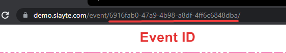
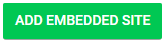
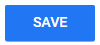

import { shareArticle } from '../../../components/share.js';
import { FaLink } from 'react-icons/fa';
import { ToastContainer, toast } from 'react-toastify';
import 'react-toastify/dist/ReactToastify.css';

export const ClickableTitle = ({ children }) => (
    <h1 style={{ display: 'flex', alignItems: 'center', cursor: 'pointer' }} onClick={() => shareArticle()}>
        {children} 
        <FaLink size="0.6em" />
    </h1>
);

<ToastContainer />

<ClickableTitle>Embedding Session Schedule and Speakers with Unique Direct Links</ClickableTitle>

## Introduction

This guide will outline the process in detail for embedding a Session Schedule or Speaker listing for a specific event. This allows individuals to also capture specific sessions of interest or speaker profiles and share links that will link back directly to the content.

When utilizing the embed feature, non-registered attendees will be able to explore the Session Schedule and Speakers without requiring login.

 

## Preparation

### Obtaining the Unique Event ID

When navigating to a specific event, the Event ID is located in the URL while accessing the event:

### 

### Creating Embed Item

There are two types of embed items that can be created to display information publicly: Event Speakers and Public Schedule. The process to achieve this for both scenarios is identical.

To configure the embed, follow these steps:

1. Navigate to **Admin** from the left pane then navigate to the Design section then select **Embedding**

2. Select**ADD EMBEDDED site to** create a new Embedding Site and select Event Schedule (Public Frame)

3.**Fill in**t he fields

* Label
* Type
* Active
* Call Uuid
* Plugins
* Login Automatically

4. Select **Save**

 

5.**Copy** the embed code by clicking in the field

6. Paste the copied embedded code into the website from Events > desired event > Public Site

/*/*Please allow up to 10 minutes for your changes to be applied.

Copy the Embed Code generated below under Embed Code and insert it into your webpage's HTML body. You can create multiple embeddings to accommodate both needs.

 

### Using Embed Widget Direct Links

After using the desired embed type as previously detailed, you can click on any Session or Speaker Profile, and copy the URL path presented at the top, of the specific item you wish to obtain.

 

 

 

 

 

