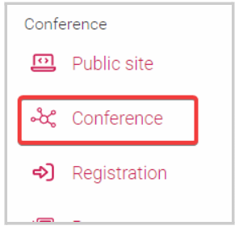
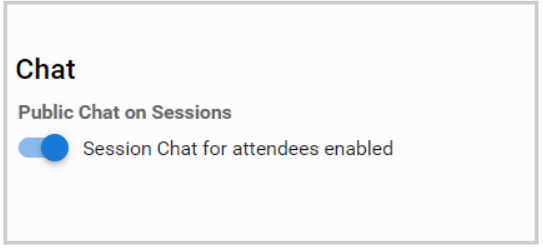
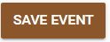

import { shareArticle } from '../../../components/share.js';
import { FaLink } from 'react-icons/fa';
import { ToastContainer, toast } from 'react-toastify';
import 'react-toastify/dist/ReactToastify.css';

export const ClickableTitle = ({ children }) => (
    <h1 style={{ display: 'flex', alignItems: 'center', cursor: 'pointer' }} onClick={() => shareArticle()}>
        {children} 
        <FaLink size="0.6em" />
    </h1>
);

<ToastContainer />

<ClickableTitle>Enable/Disable Public Chat on Sessions</ClickableTitle>

As an Administrator, you can enable or disable the chat function for attendees on sessions. 

1. Go to the desired event 

2. From the left panel, click **Conference**

****

3. Scroll down to locate the **Chat** section

4. From here, you can toggle ON/OFF **Session Chat for attendees enabled**

****

5. Click **Save Event** 

