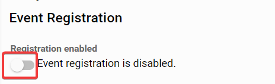
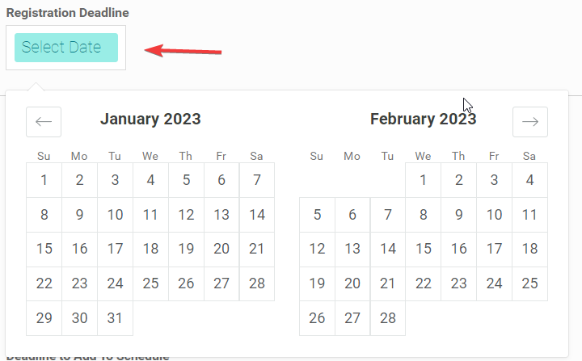
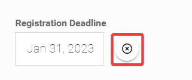
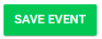

import React from 'react';
import { shareArticle } from '../../share.js';
import { FaLink } from 'react-icons/fa';
import { ToastContainer, toast } from 'react-toastify';
import 'react-toastify/dist/ReactToastify.css';

export const ClickableTitle = ({ children }) => (
    <h1 style={{ display: 'flex', alignItems: 'center', cursor: 'pointer' }} onClick={() => shareArticle()}>
        {children} 
        <FaLink size="0.6em" />
    </h1>
);

<ToastContainer />

<ClickableTitle>Enable/ Disable Registration</ClickableTitle>

1. Select the desired event

2. From the left panel, click **Registration**

2. Slayte defaults registration as **E****nabled.**However, you can disable it by toggling the button OFF

3. You can also set a **Registration Deadline,** to define the last day attendees can register. Click inside the **Select Date** box 

Note: You can modify the date at any time, by clicking in the Date box again, or you can even remove it

4. Scroll down then select **SAVE EVENT** when done

