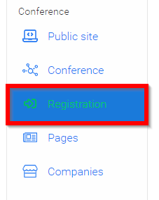
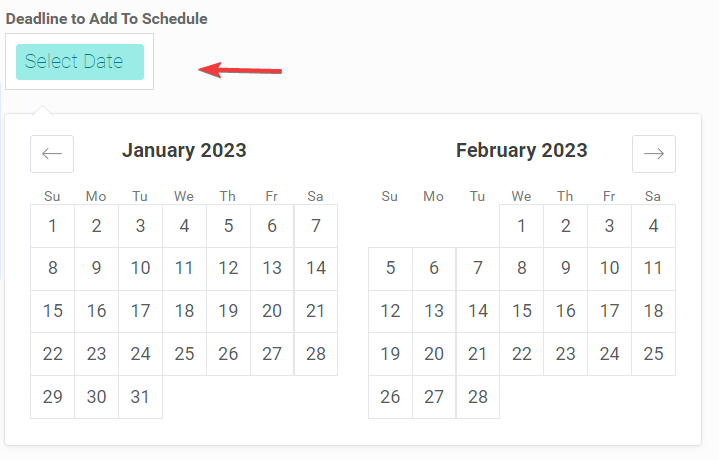
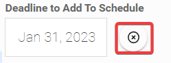
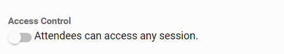

import React from 'react';
import { shareArticle } from '../../share.js';
import { FaLink } from 'react-icons/fa';
import { ToastContainer, toast } from 'react-toastify';
import 'react-toastify/dist/ReactToastify.css';

export const ClickableTitle = ({ children }) => (
    <h1 style={{ display: 'flex', alignItems: 'center', cursor: 'pointer' }} onClick={() => shareArticle()}>
        {children} 
        <FaLink size="0.6em" />
    </h1>
);

<ToastContainer />

<ClickableTitle>Enable/ disable Session Enrolling</ClickableTitle>

1. Select the desired event, then click **Registration**

2. In the **Access Control** section, you will see enrollment is enabled by default, which states attendees must enroll to access a session, then only attendees who added a session to their schedule can:

* Join the video conference
* Watch on-demand content (Library / Recordings)
* Join the session chat
* Access attachments

3. You can optionally add a deadline to prevent attendees from adding sessions to their schedule on a certain date. Under **Deadline to Add To Schedule**click the **Select Date** box to set the desired date. 

Note: You can modify the date at any time, by clicking in the Date box again, or you can even remove it

4. Scroll down then select **SAVE EVENT** when done

In the case no enrollment is desired, you can disable it by toggling OFF. This way, attendees will be able to access any session without enrolling first.

