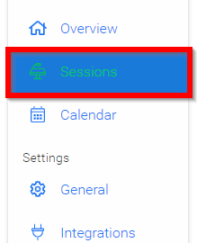
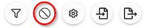

import { shareArticle } from '../../../components/share.js';
import { FaLink } from 'react-icons/fa';
import { ToastContainer, toast } from 'react-toastify';
import 'react-toastify/dist/ReactToastify.css';

export const ClickableTitle = ({ children }) => (
    <h1 style={{ display: 'flex', alignItems: 'center', cursor: 'pointer' }} onClick={() => shareArticle()}>
        {children} 
        <FaLink size="0.6em" />
    </h1>
);

<ToastContainer />

<ClickableTitle>Enable Conflict Detection</ClickableTitle>

Identifying any clashes in your events schedule ahead of time can prevent any unexpected problems on the day of your event. Conflict Detection is an in-built feature that allows you to automatically highlight any clashes in your Event schedule, based on criteria you decide.

1. From the desired event navigate to **Sessions**

2. Select the **Conflict** icon

3. Select **Conflict Configuration**

4. Slide toggle for **Enable Conflict Detection**

5. **Configure** what is a conflict by setting terms within field

6. Select **SAVE** to complete Conflict Detection  

/*/*Please note, you can elect for three searchable conflicts at a time.

