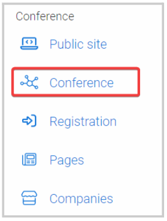

import { shareArticle } from '../../../components/share.js';
import { FaLink } from 'react-icons/fa';
import { ToastContainer, toast } from 'react-toastify';
import 'react-toastify/dist/ReactToastify.css';

export const ClickableTitle = ({ children }) => (
    <h1 style={{ display: 'flex', alignItems: 'center', cursor: 'pointer' }} onClick={() => shareArticle()}>
        {children} 
        <FaLink size="0.6em" />
    </h1>
);

<ToastContainer />

<ClickableTitle>Enable a Survey For Your Sessions</ClickableTitle>

To track the quality and satisfaction of your sessions by its attendees, you can enable a Survey function on each session that will help you to gather this information. You can follow the steps below:

1. From the Home page, go to **Events** and click the desired event tile

2. Click **Conference**

3. Scroll down to the **Survey** section. By default, this option is disabled, you can enable it by **toggling ON**

****

4. Once On, the **Survey Call Link** field will be enabled for you to enter the **Direct Link to Submission Form** 

****

**Note:**You can get the direct link to submission form, from the Call about section 

5. Click **Save Event**

**NOTE:**Currently, this feature is only available to sessions via the Slayte Mobile App

