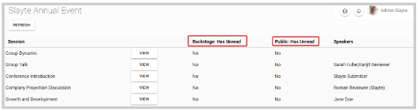
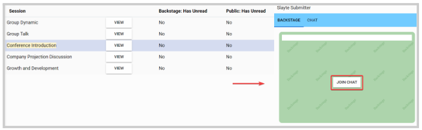
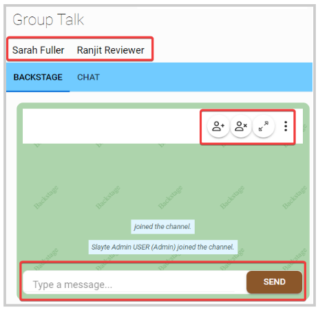

import React from 'react';
import { shareArticle } from '../../share.js';
import { FaLink } from 'react-icons/fa';
import { ToastContainer, toast } from 'react-toastify';
import 'react-toastify/dist/ReactToastify.css';

export const ClickableTitle = ({ children }) => (
    <h1 style={{ display: 'flex', alignItems: 'center', cursor: 'pointer' }} onClick={() => shareArticle()}>
        {children} 
        <FaLink size="0.6em" />
    </h1>
);

<ToastContainer />

<ClickableTitle>Event Backstage Communication</ClickableTitle>

As an Administrator, you can access the backstage and public chat per session.

If a session has an **unread message** (Backstage or Public) will be displayed to the right of each session, where you can also see the list of speakers connecting to chat

To access the chat from a specific session, click **View** and the chat window will open from the right side for both Backstage and Public. Click **Join Chat**

Within the chat window, you have the following functions available: 

* View list of speakers (Top section, under session name)
* Add members
* Remove members
* Leave Chat
* Delete Chat
* Write a message

