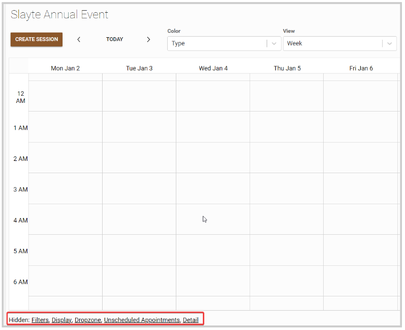
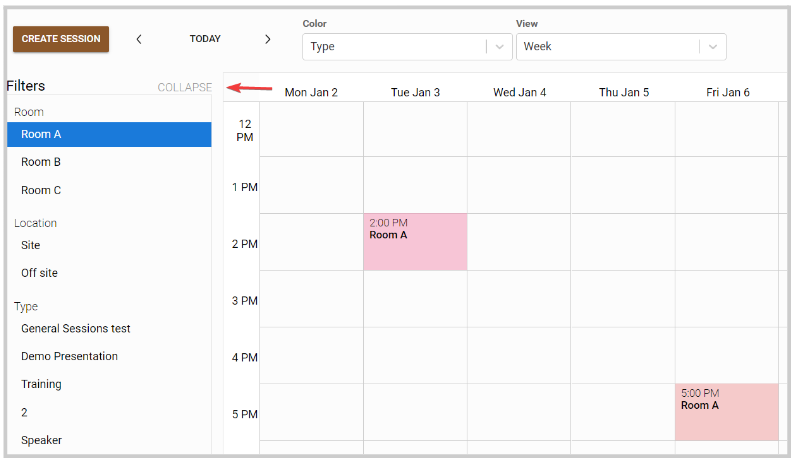
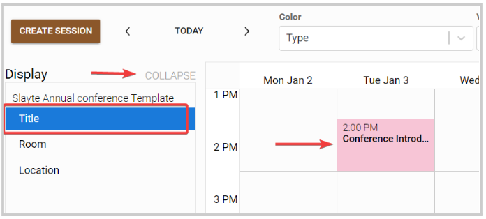
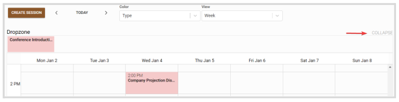
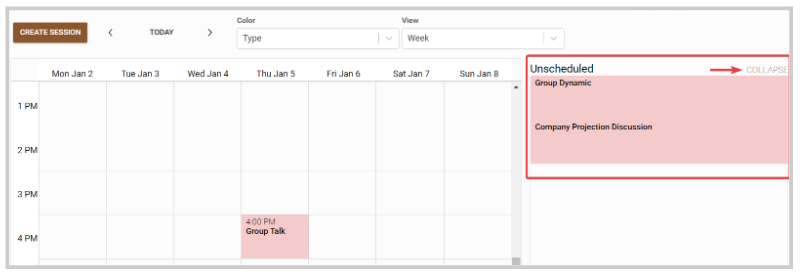
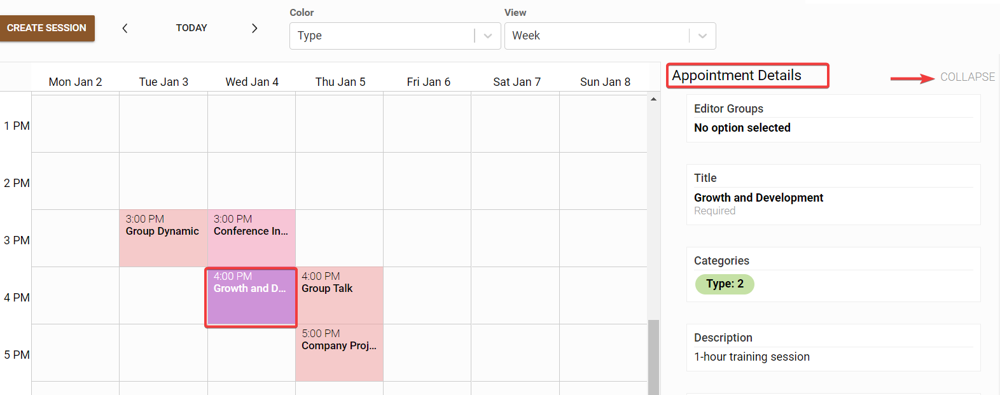

import React from 'react';
import { shareArticle } from '../../share.js';
import { FaLink } from 'react-icons/fa';
import { ToastContainer, toast } from 'react-toastify';
import 'react-toastify/dist/ReactToastify.css';

export const ClickableTitle = ({ children }) => (
    <h1 style={{ display: 'flex', alignItems: 'center', cursor: 'pointer' }} onClick={() => shareArticle()}>
        {children} 
        <FaLink size="0.6em" />
    </h1>
);

<ToastContainer />

<ClickableTitle>Event Calendar Hidden Functions</ClickableTitle>

From the Calendar view, you have available additional functions that by default are hidden; that will allow you to personalize your Calendar. 

1. From the desired event, click **Calendar**from the left panel 

2. You can find these functions at the bottom of the calendar

3. Click the function name to enable it. The selected function will remain enabled in the Calendar view, until manually remove again. 

## Filters

You can filter sessions using specific criteria, to display only applicable ones in the Calendar. To remove the Filter function, click Collapse. 

## Display

You can select the field to show in the calendar tile, which can be a default field such as Tile or any custom field. To remove the Display function, click Collapse. 

## Drop zone

When rearranging sessions in the calendar, you can drop session blocks here to temporarily store them. To remove the Drop zone function, click Collapse.

## Unscheduled Appointments

Any session that has no start/end date set yet will display in the unscheduled appointments section; for you to drag and drop directly into the calendar to the desired date and time. This action will update the Session Detail with the selected date and time. To remove the Unscheduled Appointments function, click Collapse. 

## Detail

Will display all session details when selecting one from the calendar. To remove the Detail function, click Collapse. 

