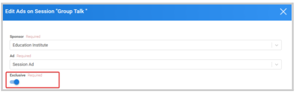

import { shareArticle } from '../../../components/share.js';
import { FaLink } from 'react-icons/fa';
import { ToastContainer, toast } from 'react-toastify';
import 'react-toastify/dist/ReactToastify.css';

export const ClickableTitle = ({ children }) => (
    <h1 style={{ display: 'flex', alignItems: 'center', cursor: 'pointer' }} onClick={() => shareArticle()}>
        {children} 
        <FaLink size="0.6em" />
    </h1>
);

<ToastContainer />

<ClickableTitle>Event Companies Sponsorship</ClickableTitle>

You can manage and assign any previously created Ads for any of the Companies as an event level, for specific sessions, Navigation, or Overview sections of the event. 

1. From the desired event, click **Companies**

2. Click the **Sponsorship** Tab on the top

3. You will be presented with the available Ad types (Overview, Navigation, or Sessions), click **Add Ads** or the **session name**.

4. From the pop-up window, first select the Sponsor to update 

5. Then select, the Ad and include any video links 

6. Click **Save   
Note:**For sessions type, you are also required to select exclusiveness by toggling ON/OFF while assigning the Ad

