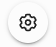
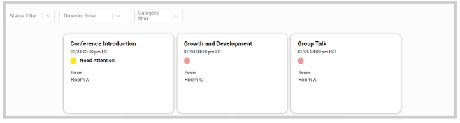
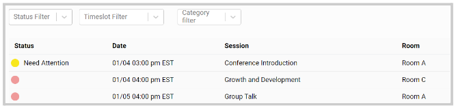
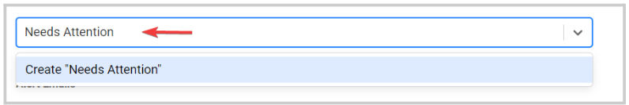
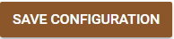
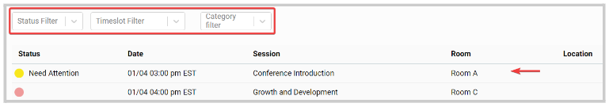
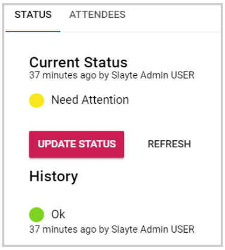
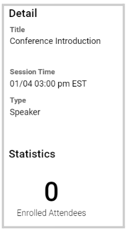
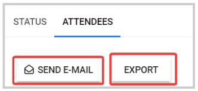

import React from 'react';
import { shareArticle } from '../../share.js';
import { FaLink } from 'react-icons/fa';
import { ToastContainer, toast } from 'react-toastify';
import 'react-toastify/dist/ReactToastify.css';

export const ClickableTitle = ({ children }) => (
    <h1 style={{ display: 'flex', alignItems: 'center', cursor: 'pointer' }} onClick={() => shareArticle()}>
        {children} 
        <FaLink size="0.6em" />
    </h1>
);

<ToastContainer />

<ClickableTitle>Event Logistics Configuration</ClickableTitle>

You can specify a workflow and assign team members to assist with the logistics of the event.

Create statuses and define whether it represents an Alert. A session with an Alert status triggers an automatic notification to all emails listed under "Alert Emails."  for them to act as needed. Additionally, your team can easily filter any session in an Alert state as it shows up in the red Alert button in the sessions table. 

1. Go to **Events**, click on the desired event title 

2. From the left panel, click **Logistics** 

3. To start/update the setup, click the gear icon  located in the right top corner. 

## Display Configuration Tab

* Time frame: Check this box to only see sessions with a start date set in the future or that are currently in progress.
* Table: Select whether you would like sessions to show as a table instead of cards.

**Cards view:**

**Table View:**

****

* Additional Columns: Select which categories/fields of sessions you want to see as columns, in addition to Status, Date, and Title.
* Additional Detail Fields: Select which categories/fields of sessions you want to see as details on the session, in addition to Status, Date, and Title.

## Logistics Configuration Tab

* Statuses: create a status by typing the name you would like to assign and pressing enter

Once created, you can assign a preferred color by clicking the color field, rename, rearrange them, set Alert, or delete if no longer needed.

* Alert Emails: Add users via their email address that will receive the session Alerts notifications
* Additional Logistics Access: Add users below who should have access to the logistics functionality, in addition to administrators.

4. Click Save Configuration 

Once customized, you can view all sessions by clicking anywhere in the session field or filtering for specific sessions

From within each session, you will have access to the following information: 

* Status and history. You can click **Update Status** to assign a new status. 
* Session Detail and Statistics

         

* Attendees. Will display a list of all attendees for the selected session, and you will be able to **Send Email** to some or all of them or **Export** the list

