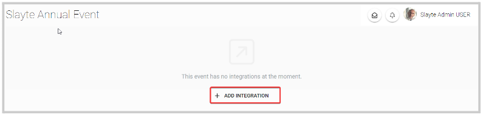
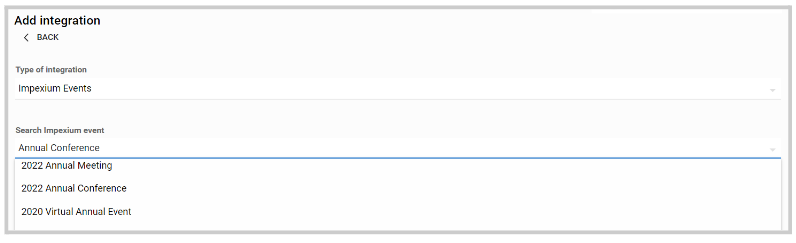
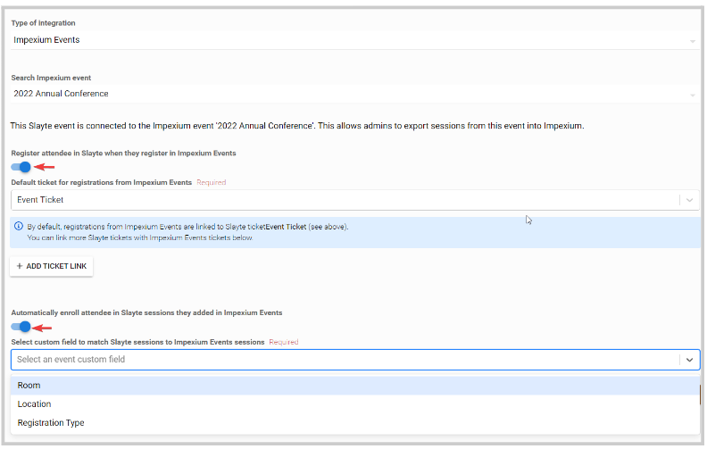
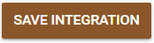
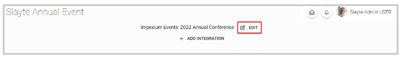
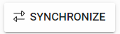

import { shareArticle } from '../../../components/share.js';
import { FaLink } from 'react-icons/fa';
import { ToastContainer, toast } from 'react-toastify';
import 'react-toastify/dist/ReactToastify.css';

export const ClickableTitle = ({ children }) => (
    <h1 style={{ display: 'flex', alignItems: 'center', cursor: 'pointer' }} onClick={() => shareArticle()}>
        {children} 
        <FaLink size="0.6em" />
    </h1>
);

<ToastContainer />

<ClickableTitle>Event Integration</ClickableTitle>

You are able to connect your Slayte event with your Impexium Event. 

1. Go to Events, and click the desired even tile

2. To the left, under the **Settings** section; click **Integrations**

3. Click **Add Integration** 

 

4. Select **Type of integration**(example: Impexium Events)

5. Then on the **Search Impexium event** field, search by name the Impexium event you would like to use to connect with this Slayte event. This allows admins to export sessions from this event into Impexium.

6. Optional. You can enable **Register attendee in Slayte when they register in Impexium Events** by toggling ON/ OFF on this option. 

If enabled, you will be required to select a previously created Slayte ticket. By default, registrations from Impexium Events are linked to the selected Slayte ticket. From here you can also enable **Automatically enroll attendee in Slayte sessions they added in Impexium Events** and **Select custom field to match Slayte sessions to Impexium Events sessions**

/*/*Note: for more information on how to create a ticket, go [here](https://docs-for-customers.slayte.com/hc/en-us/articles/4942520630291-Set-Registration-Tickets)

7. Click **Save Integration** to complete the process

You can edit the integration when needed, by clicking the **Edit** button to the right of the event name

You will now also have the option to synchronize the registrations of this event in Slayte with registrations in Impexium Events.  

This ensures all Impexium Events attendees have accounts and registrations as attendees in Slayte. As part of this, if you have automatic enrollment enabled, then the attendees will be enrolled in the corresponding Slayte sessions, too.

This one-time import is useful to ensure registrations match, but we always recommend setting up automatic registration with Impexium Events via webhooks.  

/*/* NOTE: If automatic session enrollment is enabled, all Impexium Events enrolled sessions will be re-enrolled in Slayte (even if the attendee decided previously to unenroll). This will not remove any registrations from the Slayte event where the user is not registered to the Impexium Events. For registrations to be removed from Slayte please follow the instructions for webhook setup [here.](https://docs-for-customers.slayte.com/hc/en-us/articles/4471481083411-Webhook-Integration-with-Slayte-Impexium-for-Events)

