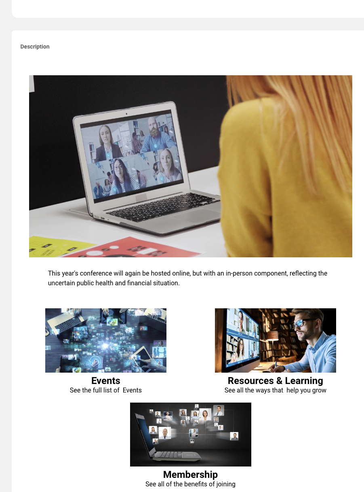

import { shareArticle } from '../../../components/share.js';
import { FaLink } from 'react-icons/fa';
import { ToastContainer, toast } from 'react-toastify';
import 'react-toastify/dist/ReactToastify.css';

export const ClickableTitle = ({ children }) => (
    <h1 style={{ display: 'flex', alignItems: 'center', cursor: 'pointer' }} onClick={() => shareArticle()}>
        {children} 
        <FaLink size="0.6em" />
    </h1>
);

<ToastContainer />

<ClickableTitle>Events Module Branding – Marketing</ClickableTitle>

This article will discuss various configurable elements and aspects for incorporating your company's logo when branding an event.

# Branding

## Home/Overview Banner and Logo

Home or “Overview” page is the primary landing page where your event attendees will land after registering and login in to the Slayte Event platform.

1. **List logo:** This logo is used to accompany the title and subtitles throughout the event. Best dimensions: Height 75px, Width 75px (PNG format).
2. **Overview banner**: This is a second banner to represent your event, this can be about the actual branding of your conference, or to visualize any other information about the event you want to cover. Recommended size to cover: Height: 300px, Width 1168px or higher resolution image with 4:1. This can be updated, at any time, as needed.
3. **Header Banner:** This banner is seen on all areas of the conference website. It is recommended that an abstract banner representing your brand is placed here. *Recommended size to cover: Height: 300px Width: 1500px or higher resolution image with 5:1 aspect ratio. It can also be a solid color.*

## Home/Overview Description

The description field offers a feature-rich WYSIWYG editor with some HTML/CSS capabilities. It can be utilized to greet your attendees, embed a welcome video for your conference, or serve other common purposes.

The sample above includes an introductory video and image with external hyperlinks.

 

## List Logo (Optional)

For attendees, accessing the event from the “Events” landing page, you can customize the event tile with a logo. The logo dimensions or the list tile are: Height: 360px, Width 300px (PNG Recommended).  
  

