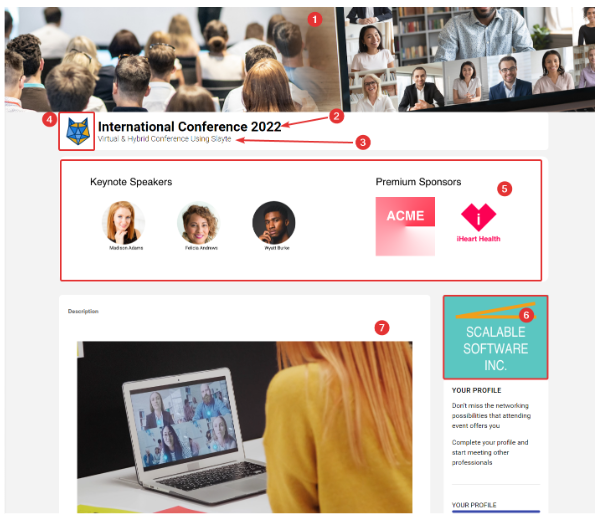
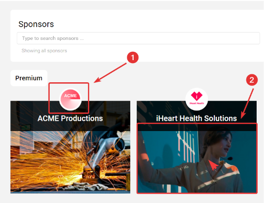
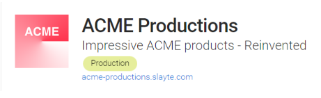
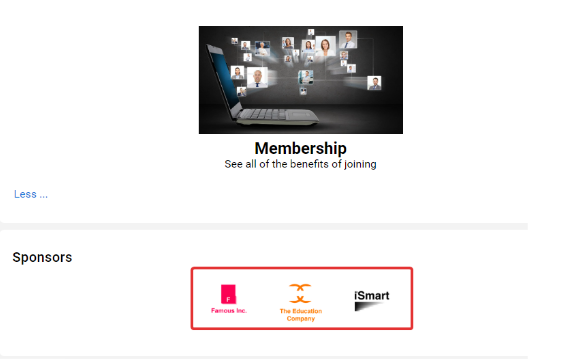
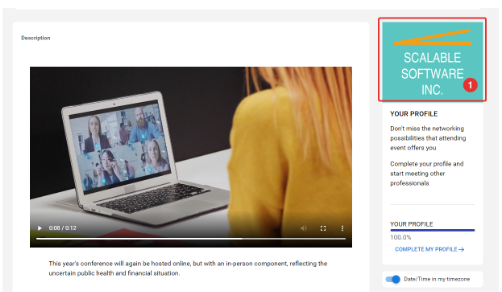
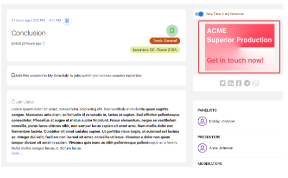

import React from 'react';
import { shareArticle } from '../../share.js';
import { FaLink } from 'react-icons/fa';
import { ToastContainer, toast } from 'react-toastify';
import 'react-toastify/dist/ReactToastify.css';

export const ClickableTitle = ({ children }) => (
    <h1 style={{ display: 'flex', alignItems: 'center', cursor: 'pointer' }} onClick={() => shareArticle()}>
        {children} 
        <FaLink size="0.6em" />
    </h1>
);

<ToastContainer />

<ClickableTitle>Events Module Branding – Web Application</ClickableTitle>

Effective branding is essential for the success of any event. One crucial aspect of this is the Home or Overview page of the event website, which presents an excellent opportunity to showcase brand identity and convey essential event information. This page incorporates several key elements, including a visually striking header banner, a clear and concise title and subtitle, a prominent logo display, a compelling overview banner, sponsor logos, and a concise but informative event description.

However, exhibitor and sponsor branding are also critical considerations. Each participating company's brand should be carefully represented throughout the event's website and promotional materials to ensure a cohesive and consistent visual identity that accurately reflects each brand's unique attributes. This attention to detail can enhance exhibitor and sponsor engagement and help drive attendee interest and participation.

# Branding

## Home/Overview Event Page

Home or “Overview” page is the primary landing page where your event attendees will land after registering and login in to the Slayte Event platform.

1. **Header Banner:** This banner is seen on all areas of the conference website. It is recommended that an abstract banner representing your event is placed here. *Recommended size to cover: Height: 300px Width: 1500px or higher resolution image with 5:1 aspect ratio. It can also be a solid color.*
2. **Title of the event:** This is the title given to your event, it will be used on various areas of the platform.
3. **Subtitle:** This is a subtitle given to your event.
4. **List logo:** This logo is used to accompany the title and subtitles throughout the event.
5. **Overview banner**: This is a second banner to represent your event, this can be about the actual branding of your conference, or to visualize any other information about the event you want to cover. Recommended size to cover: Height: 300px, Width 1200px or higher resolution image with 4:1.
6. **Sponsor Logos:** Placement of different sponsors' logos around the platform based on the configuration, see more details about exhibitors and companies. Further details are below.
7. **Description:** A rich HTML box, that allows you to freely place content as part of the event’s homepage or overview. Content can be a welcome video to greet your attendees, features about the event, or images.

## Companies

Companies around the platform are classified as sponsors and exhibitors. A company can be either a sponsor and exhibitor, or both at the same time.

### Company Categories and Level

* **Exhibitor/Sponsor level:** This will determine the hierarchy level of the sponsor or exhibitor, e.g. Diamond, Gold, Silver… etc. These are independent of either Exhibitor or Sponsor.
	+ The higher the sponsor level it is, the higher priority it will be given in the presentation around the platform.
* **Exhibitor/Sponsor Category:** Determines the classification of the company. These are mostly labels or identifiers given to the company, e.g. Media, Production, Healthcare, Media Outlet, etc.

## Companies Branding

Each company can have a general company page to represent them. For each company, the informational details can be gathered:

* Name of the company
* Contact Email
* Tagline (Optional)
* Website (Optional)
* Link (Optional)
* Link title (Optional)
* Sponsor/Exhibitor categories (Optional)
* Description of the company (Optional)
* Social Links (Optional)
* Book a Demo (Optional): Can be set that the “Book Demo” option redirects instead to an external website, rather than gathering through Slayte the user’s contact information

Each company can set a Logo and Directory image. These will be presented on each company page that represents their brand. Here are a few examples where these are presented:

### Sponsor/Exhibitor tiles

Recommended dimensions:

* **Logo**: Height 400px Width 400px
* **Directory Image**: Height 600px, Width 800px

The dedicated company page logo shares the same logo dimensions as Exhibitor/Sponsor logo tiles 

## Sponsorship Advertisement

Companies that have been designated as sponsors can place advertisements around the platform, specifically in areas: overview banner, overview secondary advert, and session advert.

### Overview Banner

This type of advertisement will cycle through the company logos previously set on each company page, based on the designated exhibitor tier

### Secondary Overview Banner

This will cycle through adverts (if multiple) that have been designated as the “Overview Ad”. Recommended size: Width: 300px, Height 200px or higher at 3:2 aspect ratio.

### Session Detail Advert

This type of advert will cycle through any sponsored session adverts that have been configured. It can also be designated as an exclusive sponsorship advert in the session.

Recommended size: Width: 300px, Height 200px or higher at 3:2 aspect ratio

## Enriched Company Pages

For each company, an administrator, or company team can create an enriched company page. This is entirely optional, however, this can flesh out even further the virtual aspect of companies.

Additionally, an administrator can invite company team members with limited aspects to customize their company page or modify descriptions to their satisfaction.

