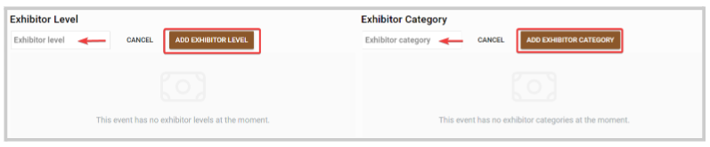
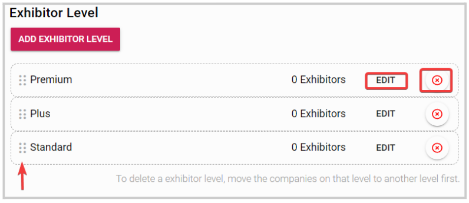

import React from 'react';
import { shareArticle } from '../../share.js';
import { FaLink } from 'react-icons/fa';
import { ToastContainer, toast } from 'react-toastify';
import 'react-toastify/dist/ReactToastify.css';

export const ClickableTitle = ({ children }) => (
    <h1 style={{ display: 'flex', alignItems: 'center', cursor: 'pointer' }} onClick={() => shareArticle()}>
        {children} 
        <FaLink size="0.6em" />
    </h1>
);

<ToastContainer />

<ClickableTitle>Exhibitor and Sponsors settings</ClickableTitle>

You can create Exhibitor/Sponsors levels and categories to identify and grant greater visibility to the event companies. 

1. Go to **Events**, and select the desired event 

2. From the left panel, click **Companies**

3. Click **Exhibitor and Sponsor Settings** from the top bar

4. Under the Exhibitor or Sponsor section, click Add **Exhibitor Level** or Add **Exhibitor Category** to start creating them.

5. Enter the **name**, then click **Add**

Once created, from the main page, you can edit, delete if no longer needed or rearrange the order you would like them to be displayed. 

Note: Exhibitors and Sponsors will be displayed in the order you select here. The highest-level sponsors/exhibitors will be displayed first. Exhibitors and Sponsors categories are used for attendee filtering.

