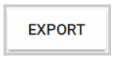
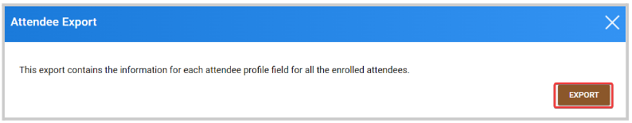
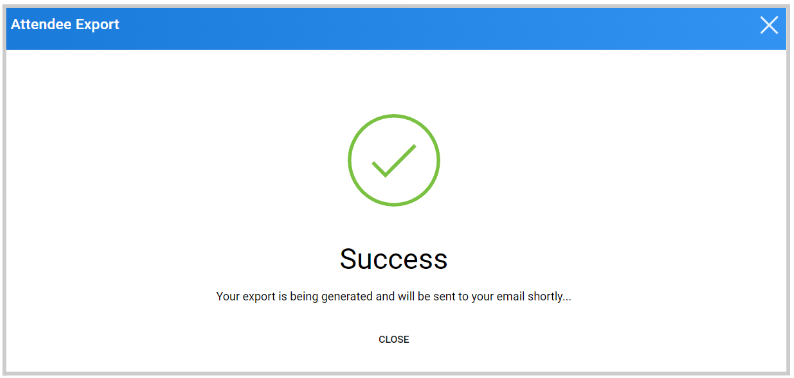

import { shareArticle } from '../../../components/share.js';
import { FaLink } from 'react-icons/fa';
import { ToastContainer, toast } from 'react-toastify';
import 'react-toastify/dist/ReactToastify.css';

export const ClickableTitle = ({ children }) => (
    <h1 style={{ display: 'flex', alignItems: 'center', cursor: 'pointer' }} onClick={() => shareArticle()}>
        {children} 
        <FaLink size="0.6em" />
    </h1>
);

<ToastContainer />

<ClickableTitle>Export Attendees List</ClickableTitle>

1. Go to **Events**, and click the event tile 

2. From the left panel, click **Attendees**

3. Click the Export button on the top 

4. On the pop-up window, click **Export** 

5. You will receive the following confirmation window 

Note: at the moment, this report is only generated as a .CSV type of file. 

