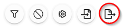

import React from 'react';
import { shareArticle } from '../../share.js';
import { FaLink } from 'react-icons/fa';
import { ToastContainer, toast } from 'react-toastify';
import 'react-toastify/dist/ReactToastify.css';

export const ClickableTitle = ({ children }) => (
    <h1 style={{ display: 'flex', alignItems: 'center', cursor: 'pointer' }} onClick={() => shareArticle()}>
        {children} 
        <FaLink size="0.6em" />
    </h1>
);

<ToastContainer />

<ClickableTitle>Export Session(s)</ClickableTitle>

1. From the desired event navigate to **Sessions**

2. Select the **Export** icon

3. Select **Export Option**:

1. [Export: Sessions to CSV](https://docs-for-customers.slayte.com/hc/en-us/articles/4938456239379-Export-Sessions-to-CSV-)
2. [Export: Program Index](https://docs-for-customers.slayte.com/hc/en-us/articles/4938402643731-Export-Program-Index-)
3. [Export: Participant Book](https://docs-for-customers.slayte.com/hc/en-us/articles/4938396247827-Export-Participant-Book-)
4. [Export: Session Book](https://docs-for-customers.slayte.com/hc/en-us/articles/4938413269523-Export-Session-Book-)
5. [Export: Session Enrollment](https://docs-for-customers.slayte.com/hc/en-us/articles/4938427793555-Export-Session-Enrollment-)

