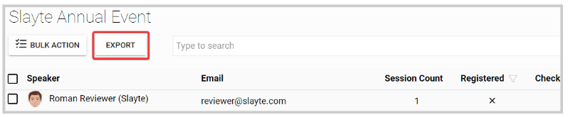
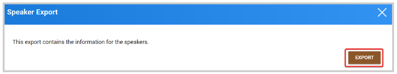
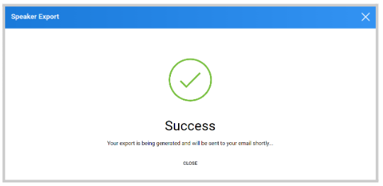

import { shareArticle } from '../../../components/share.js';
import { FaLink } from 'react-icons/fa';
import { ToastContainer, toast } from 'react-toastify';
import 'react-toastify/dist/ReactToastify.css';

export const ClickableTitle = ({ children }) => (
    <h1 style={{ display: 'flex', alignItems: 'center', cursor: 'pointer' }} onClick={() => shareArticle()}>
        {children} 
        <FaLink size="0.6em" />
    </h1>
);

<ToastContainer />

<ClickableTitle>Export Speaker's Data</ClickableTitle>

As an Administrator, you can generate a report that includes all Speaker's data including, profile details, check-in/ registration status, session count, invited date, among other information.

1. From the desired event, click **Speakers**

2. Click **Export** from the top bar 

3. On the pop-up window, click **Export**

4. You will receive the following confirmation message, and an email with the attached file. 

Note: at the moment, this report is only generated as a .CSV type of file. 

