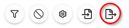

import { shareArticle } from '../../../components/share.js';
import { FaLink } from 'react-icons/fa';
import { ToastContainer, toast } from 'react-toastify';
import 'react-toastify/dist/ReactToastify.css';

export const ClickableTitle = ({ children }) => (
    <h1 style={{ display: 'flex', alignItems: 'center', cursor: 'pointer' }} onClick={() => shareArticle()}>
        {children} 
        <FaLink size="0.6em" />
    </h1>
);

<ToastContainer />

<ClickableTitle>Export: Session Book</ClickableTitle>

1. From the desired event navigate to **Sessions**

2. Select the **Export** icon

3. Select **Export Option**then Export: Session Book

4. Select from **Available Fields** section and drag and drop options into **User Fields** then select **NEXT**

5. From the **SESSION EXPORT**  select **Available Fields** then **NEXT**

6. From the **USER FIELDS (SEE BLUE FIELDS IN STEP 1)** select **Available Fields** then drag and drop to **User Fields**

7. In the **SUBSESSION (SEE GREEN FIELDS IN STEP 1)** select from the **Available Fields**

* **List Layout** is set to Newline after each
* **Subsessions Layout** to Title, Newline, Speakers
* **Speakers Display** by dragging and dropping Available Fields into Speaker Display

8. Select **FINISH**

9. Select **CLOSE** on "Your export is being generated and will be sent to your email shortly..."

10. Navigate to your email to **download CSV** report titled: **Report: Session Export**

