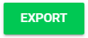

import { shareArticle } from '../../../components/share.js';
import { FaLink } from 'react-icons/fa';
import { ToastContainer, toast } from 'react-toastify';
import 'react-toastify/dist/ReactToastify.css';

export const ClickableTitle = ({ children }) => (
    <h1 style={{ display: 'flex', alignItems: 'center', cursor: 'pointer' }} onClick={() => shareArticle()}>
        {children} 
        <FaLink size="0.6em" />
    </h1>
);

<ToastContainer />

<ClickableTitle>Export: Session Enrollment</ClickableTitle>

1. From the desired event navigate to **Sessions**

2. Select the **Export** icon

3. Select **Export Option**then Export: Session Enrollment This will export the number of enrolled attendees for each session.

4. Select **EXPORT**

5. Select **CLOSE** on "Your export is being generated and will be sent to your email shortly..."

6. Navigate to your email to **download CSV** report titled: **Report: Session Enrollment**

 

 

