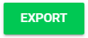

import React from 'react';
import { shareArticle } from '../../share.js';
import { FaLink } from 'react-icons/fa';
import { ToastContainer, toast } from 'react-toastify';
import 'react-toastify/dist/ReactToastify.css';

export const ClickableTitle = ({ children }) => (
    <h1 style={{ display: 'flex', alignItems: 'center', cursor: 'pointer' }} onClick={() => shareArticle()}>
        {children} 
        <FaLink size="0.6em" />
    </h1>
);

<ToastContainer />

<ClickableTitle>Export: Sessions to CSV</ClickableTitle>

1. From the desired event navigate to **Sessions**

2. Select the **Export** icon

3. Select **Export Option**then Export: Sessions to CSV

4. Select **EXPORT** to trigger an export of all sessions as rows with columns

5. Select **DISCARD** on message "You will shortly receive an e-mail with the export"

6. Navigate to your email to **download CSV** report titled: **Report: All Sessions Export**

