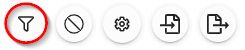
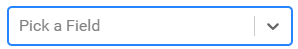
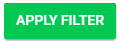

import { shareArticle } from '../../../components/share.js';
import { FaLink } from 'react-icons/fa';
import { ToastContainer, toast } from 'react-toastify';
import 'react-toastify/dist/ReactToastify.css';

export const ClickableTitle = ({ children }) => (
    <h1 style={{ display: 'flex', alignItems: 'center', cursor: 'pointer' }} onClick={() => shareArticle()}>
        {children} 
        <FaLink size="0.6em" />
    </h1>
);

<ToastContainer />

<ClickableTitle>Filter Session(s)</ClickableTitle>

The Sessions List View can be modified, reordered and saved for later use. Once you are pleased with the list format you can save your current view by clicking Save View on the left-hand side of the page. The saved view will include any Filters or column sorting added. Whichever filter was last loaded/saved on your Sessions list will be used the next time the Session list is loaded.

 

1. From the desired event navigate to **Sessions**

2. Select the **Filter** icon

3. Select **+ADD FILTER**

4. Click inside **Pick a Field**

5. Choose from the session list of options to select from

6. When ready select the **APPLY FILTER** button

7. Your session list will update showing only the **filtered results**

