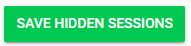

import React from 'react';
import { shareArticle } from '../../share.js';
import { FaLink } from 'react-icons/fa';
import { ToastContainer, toast } from 'react-toastify';
import 'react-toastify/dist/ReactToastify.css';

export const ClickableTitle = ({ children }) => (
    <h1 style={{ display: 'flex', alignItems: 'center', cursor: 'pointer' }} onClick={() => shareArticle()}>
        {children} 
        <FaLink size="0.6em" />
    </h1>
);

<ToastContainer />

<ClickableTitle>Hide Session(s)</ClickableTitle>

1. From the desired event navigate to select **Conference**

2. The top section in ***Hidden sessions*** select **EDIT**

3. From the list select which sessions will be hidden by **clicking inside the check box** next to the name of the session

4. Select **SAVE HIDDEN SESSIONS** when done

5. You will be redirected to the **Conference** page to get the **total number of hidden sessions**

