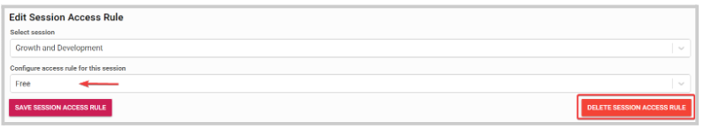

import { shareArticle } from '../../../components/share.js';
import { FaLink } from 'react-icons/fa';
import { ToastContainer, toast } from 'react-toastify';
import 'react-toastify/dist/ReactToastify.css';

export const ClickableTitle = ({ children }) => (
    <h1 style={{ display: 'flex', alignItems: 'center', cursor: 'pointer' }} onClick={() => shareArticle()}>
        {children} 
        <FaLink size="0.6em" />
    </h1>
);

<ToastContainer />

<ClickableTitle>How to edit access rule for specific sessions</ClickableTitle>

1. Go to the desired event 

2. From the left panel, click **Registration** 

3. Under the **Access Control** section, locate **Access to specific sessions** and click **Edit**

****

4. From the next page, to the right of the rule you would like to modify click **Edit**

From here, you can select a different rule criteria or even delete the rule if no longer needed 

5. When done with the changes, click **Save Session Access Rule** 

6. Then, click **Save Access Rule**

