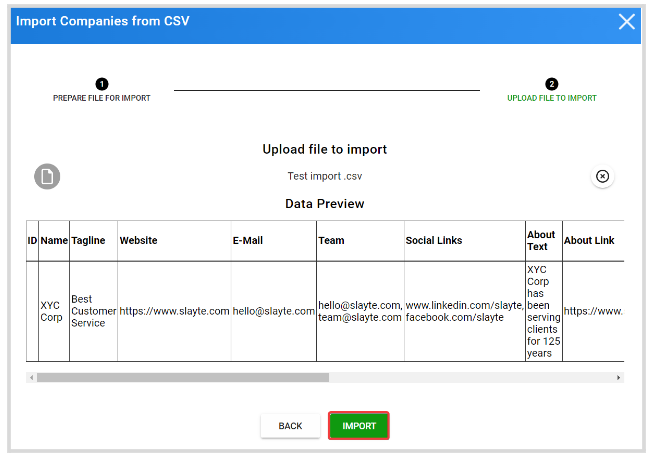

import { shareArticle } from '../../../components/share.js';
import { FaLink } from 'react-icons/fa';
import { ToastContainer, toast } from 'react-toastify';
import 'react-toastify/dist/ReactToastify.css';

export const ClickableTitle = ({ children }) => (
    <h1 style={{ display: 'flex', alignItems: 'center', cursor: 'pointer' }} onClick={() => shareArticle()}>
        {children} 
        <FaLink size="0.6em" />
    </h1>
);

<ToastContainer />

<ClickableTitle>Import Companies in Bulk via CSV</ClickableTitle>

When needed, you can create multiple companies at once to be part of your event as **Exhibitors** or **Sponsors**. Find the steps to follow below: 

1. Go to **Events**, and select the event tile 

2. From the left pane, click **Companies** 

3. Click **Import Companies From CSV**

4. From the pop-up window, click **download the company-import template,** which will include all fields that can be customized for the company profile. And click **download company levels and categories**, which will include the existing levels and categories IDs to use to assign them to these new companies. 

5. Fill in the CSV with each company's details. To assign a Level or Category, use their respective ID listed in the previously downloaded file as below 

6. Click **Continue**

7. Click **Upload CSV File**, and select the file to use from your computer

8. From the **Data Preview** window, click **Import**

9. You will receive the following message when successfully created

