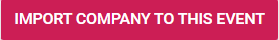

import React from 'react';
import { shareArticle } from '../../share.js';
import { FaLink } from 'react-icons/fa';
import { ToastContainer, toast } from 'react-toastify';
import 'react-toastify/dist/ReactToastify.css';

export const ClickableTitle = ({ children }) => (
    <h1 style={{ display: 'flex', alignItems: 'center', cursor: 'pointer' }} onClick={() => shareArticle()}>
        {children} 
        <FaLink size="0.6em" />
    </h1>
);

<ToastContainer />

<ClickableTitle>Import Company from another Event</ClickableTitle>

Sometimes, the same company can be part of more than one event. For this, you can easily import companies from other events. 

1. Go to **Events**, and click the desired event tile

2. From the left panel, click Companies

3. While on the Companies tab, click **Import Company from Another Event** 

4. Search the company by name, and select from the drop-down menu

5. You will be required to select if this company will be either Exhibitor or Sponsor for this event, and specify its level

6. Click **Import Company to this Event** when ready

