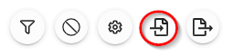
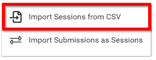
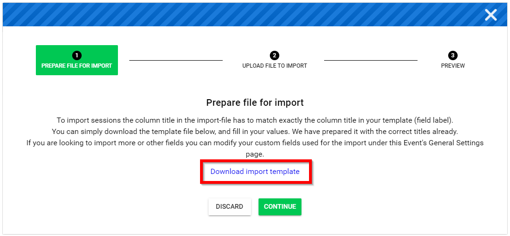

import React from 'react';
import { shareArticle } from '../../share.js';
import { FaLink } from 'react-icons/fa';
import { ToastContainer, toast } from 'react-toastify';
import 'react-toastify/dist/ReactToastify.css';

export const ClickableTitle = ({ children }) => (
    <h1 style={{ display: 'flex', alignItems: 'center', cursor: 'pointer' }} onClick={() => shareArticle()}>
        {children} 
        <FaLink size="0.6em" />
    </h1>
);

<ToastContainer />

<ClickableTitle>Import Sessions from CSV</ClickableTitle>

1. From the desired event navigate to **Sessions**

2. Select the **Import** icon

3. Select **Import Sessions from CSV**

4. Prepare file for import by selecting the **Download import template** (EACH TIME) to ensure that you have mapped all custom fields and categories prior to importing then select **CONTINUE**

5. **Upload** the newest CSV file version of the import file then select continue

6. **Preview** the data

7. Select **IMPORT**

8. Select **DISMISS** on "Import started - Your import was started. You will receive an email confirmation in a few minutes. " acknowledgement

