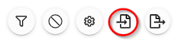
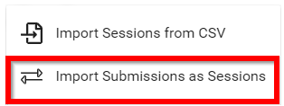
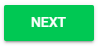
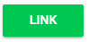

import React from 'react';
import { shareArticle } from '../../share.js';
import { FaLink } from 'react-icons/fa';
import { ToastContainer, toast } from 'react-toastify';
import 'react-toastify/dist/ReactToastify.css';

export const ClickableTitle = ({ children }) => (
    <h1 style={{ display: 'flex', alignItems: 'center', cursor: 'pointer' }} onClick={() => shareArticle()}>
        {children} 
        <FaLink size="0.6em" />
    </h1>
);

<ToastContainer />

<ClickableTitle>Import Submission(s) as Session(s)</ClickableTitle>

1. From the desired event navigate to **Sessions**

2. Select the **Import** icon

3. Select Import Submissions as Sessions

4. **Select the desired call** by typing in the name of the call then select from the drop down menu 

5. **Select which submissions** to import by selecting All or individually

Please note, you can filter by [**submission status**](https://docs-for-customers.slayte.com/hc/en-us/articles/4413466153491-Change-Submission-s-Status) before making decision to import.

6. Select **NEXT** in modal window

7. You will be redirected to the **Import/Link Submissions as Sessions** modal to map submission field(s) to event

8. **Fill in** mapping

9. Set **Synchronize data** to **Link Call and Event**

10. Select **LINK** when finished

****

11. Select **DISMISS** from Importing submission(s) as sessions - We've begun to import your submissions as sessions. An email with a status report will be sent to you when the process is complete

