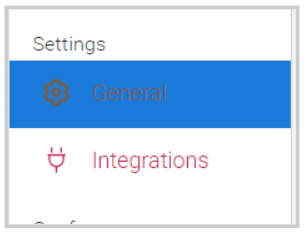
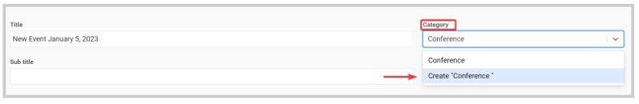

import { shareArticle } from '../../../components/share.js';
import { FaLink } from 'react-icons/fa';
import { ToastContainer, toast } from 'react-toastify';
import 'react-toastify/dist/ReactToastify.css';

export const ClickableTitle = ({ children }) => (
    <h1 style={{ display: 'flex', alignItems: 'center', cursor: 'pointer' }} onClick={() => shareArticle()}>
        {children} 
        <FaLink size="0.6em" />
    </h1>
);

<ToastContainer />

<ClickableTitle>Label Event Category</ClickableTitle>

1. From the Home page, select **Events** from the tile or from the left panel

2. Click the desired event tile 

3. Under the Settings section, click the **General** tab

4. Locate the **Category** field, and search by name of a previously created category, or continue typing the name to create a new one by clicking **Create** or pressing enter.

Suggestions: *Trade Show, Annual Conference, Meeting*

5. Select **SAVE** to complete changes

/*/* Note: Once you have assigned a category, this cannot be removed. You can only, assign/ create another category. 

