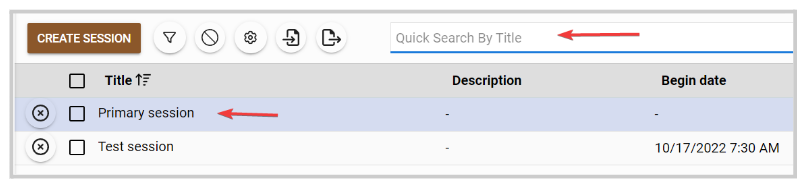
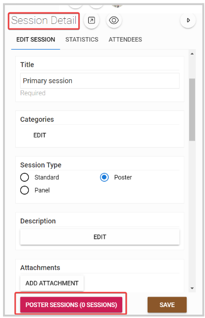
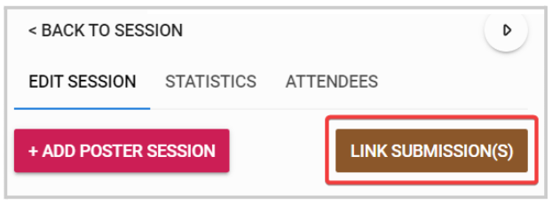
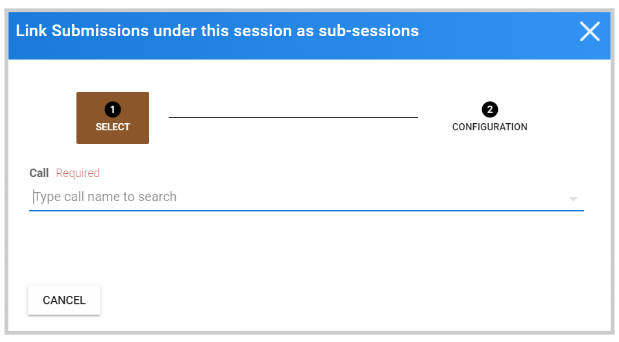
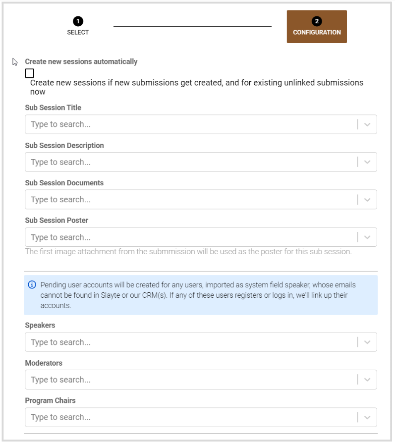
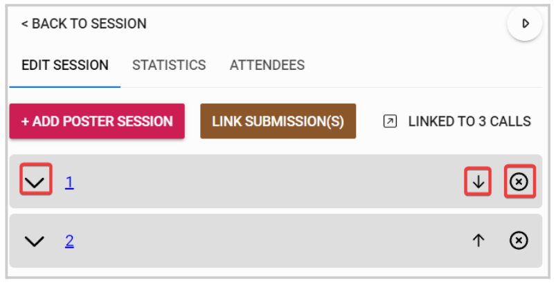
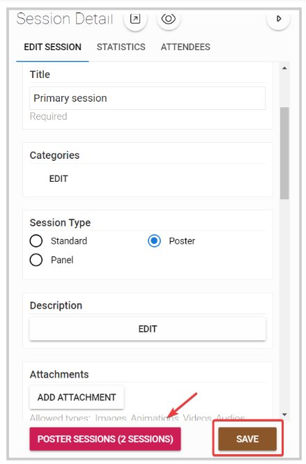

import React from 'react';
import { shareArticle } from '../../share.js';
import { FaLink } from 'react-icons/fa';
import { ToastContainer, toast } from 'react-toastify';
import 'react-toastify/dist/ReactToastify.css';

export const ClickableTitle = ({ children }) => (
    <h1 style={{ display: 'flex', alignItems: 'center', cursor: 'pointer' }} onClick={() => shareArticle()}>
        {children} 
        <FaLink size="0.6em" />
    </h1>
);

<ToastContainer />

<ClickableTitle>Link submissions as sub-sessions on an event session</ClickableTitle>

On an existing event session, you can link multiple submissions as sub-sessions. Note, in order to have this option, the session type needs to be either **Panel** or **Poster**. 

**Poster** sessions are meant to showcase works of art in research in categorized groups from individuals, whereas a **Panel** session is a group of experts that respond to the audience

1. From the desired event, navigate to **Sessions**

2. Locate the session from the sessions list, or search by session name on the top search bar

3. On the **Sessions details** tab, click the **Poster/Panel Sessions** button 

4. Click **Link Submissions**

5. **Select the desired call** by typing in the name of the call, then select from the drop-down menu

6. **Select which submissions** to import by selecting All or individually

7. **Fill in the** mapping

8. Set **Synchronize data** to **Link Call and Event**

9. Click **LINK** when finished.

10. Submissions will now be listed as sub-sessions. You can view the submission details, move up/down, or remove them. 

11. Click **Back to Session** on the top to go back to the main session details, you should now see the recently linked sub-session, and click **Save.**

****

