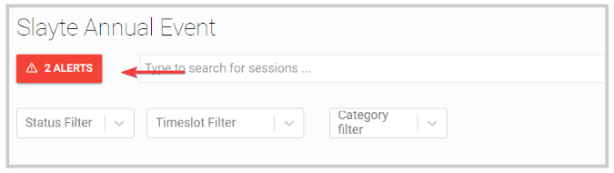
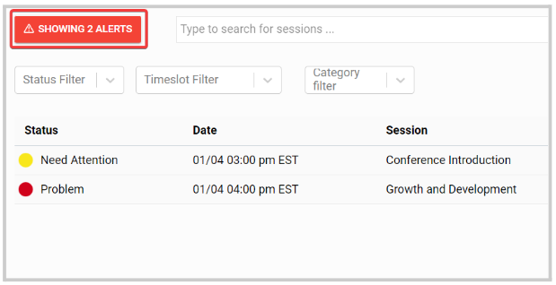
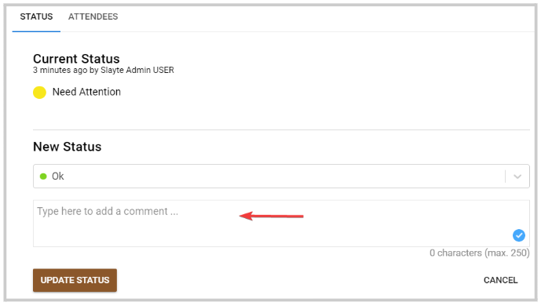
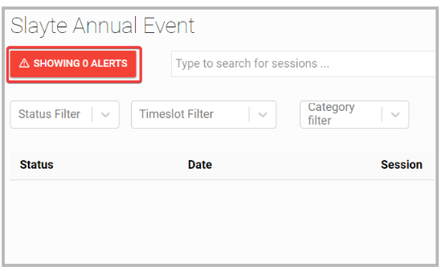

import React from 'react';
import { shareArticle } from '../../share.js';
import { FaLink } from 'react-icons/fa';
import { ToastContainer, toast } from 'react-toastify';
import 'react-toastify/dist/ReactToastify.css';

export const ClickableTitle = ({ children }) => (
    <h1 style={{ display: 'flex', alignItems: 'center', cursor: 'pointer' }} onClick={() => shareArticle()}>
        {children} 
        <FaLink size="0.6em" />
    </h1>
);

<ToastContainer />

<ClickableTitle>Logistics Alerts</ClickableTitle>

1. Go to **Events**, click the desired event tile 

2. From the left panel, click **Logistics**

3. You can locate any alerts on the left top corner of the main page, then click the **Alert** button 

4. It will display the **Showing Alert** view which will include only affected sessions to review. You can click anywhere in the session field for more details. 

5. Once reviewed, you can update the status and leave comments if desired.

****

6. Click **Save Status**

7. You can continue with the next Alert until all alerts are reviewed. Click the **Showing Alerts** button to go back to the main page

****

