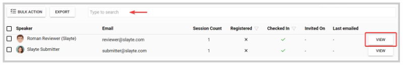
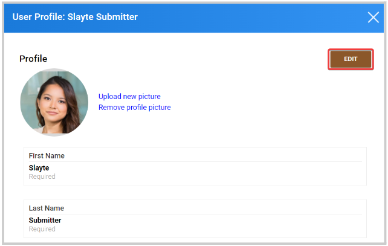
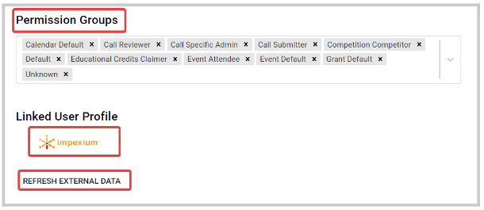

import { shareArticle } from '../../../components/share.js';
import { FaLink } from 'react-icons/fa';
import { ToastContainer, toast } from 'react-toastify';
import 'react-toastify/dist/ReactToastify.css';

export const ClickableTitle = ({ children }) => (
    <h1 style={{ display: 'flex', alignItems: 'center', cursor: 'pointer' }} onClick={() => shareArticle()}>
        {children} 
        <FaLink size="0.6em" />
    </h1>
);

<ToastContainer />

<ClickableTitle>Manage Speaker' Profile</ClickableTitle>

As an Administrator, you can view and edit speaker's profiles if required. 

1. Go to **Events**, click the desired event's tile

2. From the left panel, click **Speakers**

3. From the speaker list, you can search by name/ email address from the search field on the top, or click **View** to the right to access their profile.

4. If needed, from the speaker's profile window; click **Edit**to update applicable fields (First Name, Last Name, Biography, etc) and Upload/ Remove the profile picture. 

5. Click **Save**

 From here, you can also assign/remove permissions, access their Impexium profile if applicable, or refresh external data to update their profile information.

