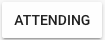

import { shareArticle } from '../../../components/share.js';
import { FaLink } from 'react-icons/fa';
import { ToastContainer, toast } from 'react-toastify';
import 'react-toastify/dist/ReactToastify.css';

export const ClickableTitle = ({ children }) => (
    <h1 style={{ display: 'flex', alignItems: 'center', cursor: 'pointer' }} onClick={() => shareArticle()}>
        {children} 
        <FaLink size="0.6em" />
    </h1>
);

<ToastContainer />

<ClickableTitle>Override Session Attendance</ClickableTitle>

Certain scenarios may necessitate marking an attendee as “attended” for a specific session they either missed or partially completed. As an Administrator, you can do this to make an exception. You can follow these steps:

1. Log in to your Slayte platform as an Administrator.
2. Navigate to the specific event containing the session in question.
3. From the Navigation Menu, select the  option.
4. Scroll through the “Attendees” list to find the attendee whose status you wish to update. Click on the  button next to their name.
5. You will then be presented with a list of all sessions associated with the event. Locate the specific session for which you want to mark the user as “Attended.”
6. Beside the session, there will be a toggle switch. Click on it to mark the attendee as “Attended” for that session.
7. The change is immediate, and there's no need to save your changes or perform any additional actions. You can safely exit the screen after completing these steps.

You can also use this method for the case where participation may need to be revoked by toggling the button to off.

