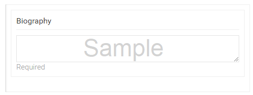
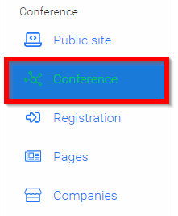
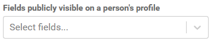
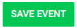

import React from 'react';
import { shareArticle } from '../../share.js';
import { FaLink } from 'react-icons/fa';
import { ToastContainer, toast } from 'react-toastify';
import 'react-toastify/dist/ReactToastify.css';

export const ClickableTitle = ({ children }) => (
    <h1 style={{ display: 'flex', alignItems: 'center', cursor: 'pointer' }} onClick={() => shareArticle()}>
        {children} 
        <FaLink size="0.6em" />
    </h1>
);

<ToastContainer />

<ClickableTitle>Plan for Networking</ClickableTitle>

As a Super Administrator you will be able to edit the user profile template in the Admin console under Users > Profile to create custom fields for the user profile and in the Conference you will be able to select which fields are displayed.

**Create Custom Profile Fields**

1. Navigate to **Admin** > **Users** > **Profile**

2. To add to the users profile select the **EDIT** button

3. Create a custom **profile** field

Profile options available:

* Text (Single line)
* Text Area (Multiple lines)
* User Search
* Attachment
* Autocomplete
* Radio Group
* Checkboxes
* Yes/No
* Computer Information
* Slider
* Date of Birth
* Date Picker
* Date Time Picker
* Date Range Selection
* Media Link
* Virtual Meeting
* Categories
* People
* Attendance
* Static Text
* Static Attachments
* Impexium Profile Information

4. Select **SAVE** when finished to complete changes

**Customize Fields displayed in Conference**

1. Navigate to Events > *Desired Event* > **Conference**

2. Scroll down to the section **People** then click inside the **drop-down menu** to select the previously created profile field(s) to be publicly visible on a person's profile

3. Select **SAVE EVENT** when finished making desired changes

