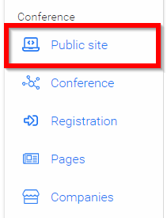
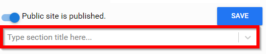
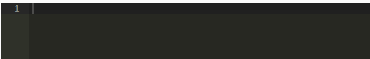
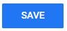

import React from 'react';
import { shareArticle } from '../../share.js';
import { FaLink } from 'react-icons/fa';
import { ToastContainer, toast } from 'react-toastify';
import 'react-toastify/dist/ReactToastify.css';

export const ClickableTitle = ({ children }) => (
    <h1 style={{ display: 'flex', alignItems: 'center', cursor: 'pointer' }} onClick={() => shareArticle()}>
        {children} 
        <FaLink size="0.6em" />
    </h1>
);

<ToastContainer />

<ClickableTitle>Public Site Branding and CSS</ClickableTitle>

The public site of your conference is accessible to anyone on the internet with the link to your conference. You can enable/disable the public site, and customize the style on the following site of your conference administration.

1. From the desired event select **Public Site**

2. Ensure your public site is **published** (slide indicator is filled in)

3. Type in **title** of custom styling

4. Hit **Enter** on your Keyboard to save title

5. Type/Paste in **CSS styling code** in provided window

6. Use the left screen to **preview** changes before saving

7. When ready select **SAVE** to complete changes

Please note, you can find Slayte's default CSS styling of the public site **[here](https://drive.google.com/file/d/1KsSBHNDcrNdNn0bG0FcTQX-RRkAG58M2/view)**. Use this to let your website/marketing team know which classes they can use the apply the styles you need.

As an administrator you can view what your **Public Site** will look like by navigating to the **Overview** menu option in the left pane then select **Switch to Attendee View**. When ready to leave the preview select **Switch to Admin View**. Another option, take the URL provided in the event and paste into a private browsing session then remove **/admin**

**Example: companyname.slayte.com/event/uuid**

