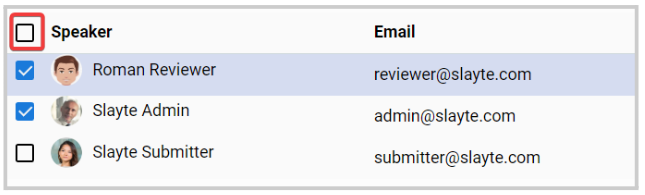
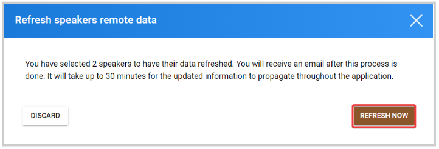

import React from 'react';
import { shareArticle } from '../../share.js';
import { FaLink } from 'react-icons/fa';
import { ToastContainer, toast } from 'react-toastify';
import 'react-toastify/dist/ReactToastify.css';

export const ClickableTitle = ({ children }) => (
    <h1 style={{ display: 'flex', alignItems: 'center', cursor: 'pointer' }} onClick={() => shareArticle()}>
        {children} 
        <FaLink size="0.6em" />
    </h1>
);

<ToastContainer />

<ClickableTitle>Refresh Remote User Data for Speakers</ClickableTitle>

You can refresh the speakers' profile data when needed to ensure the most up-to-date information is listed in the event. 

1. From the desired event, go to **Speakers**

2. Select from the list, the speakers that apply or all by checking the box next to **Speaker**

****

3. Once the speakers have been selected, the Bulk Action button will be enabled. Click **Bulk Action** and select **Refresh Remote User Data.**

4. From the pop-up window, click **Refresh Now** 

 

