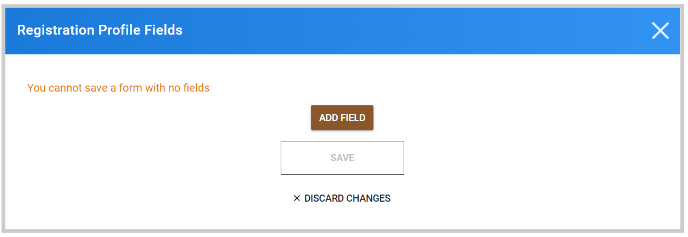

import React from 'react';
import { shareArticle } from '../../share.js';
import { FaLink } from 'react-icons/fa';
import { ToastContainer, toast } from 'react-toastify';
import 'react-toastify/dist/ReactToastify.css';

export const ClickableTitle = ({ children }) => (
    <h1 style={{ display: 'flex', alignItems: 'center', cursor: 'pointer' }} onClick={() => shareArticle()}>
        {children} 
        <FaLink size="0.6em" />
    </h1>
);

<ToastContainer />

<ClickableTitle>Registration Profile Configuration</ClickableTitle>

As an Administrator, you can customize the profile fields that attendees fill in during registration specific to each event. This profile can be edited once registered, stored for each attendee per event, and will not be shared between events. To complete the set-up follow these steps:

1. Navigate to the desired event  
2. On the left, click **Registration**   
3. Scroll down to the **Registration Profile** section and **click Edit Registration Profile**

4. Click **Add field** and select the desired field to use

**/*/*NOTE:** Default or custom user profile fields already defined as Administrator in the general platform Admin setup should not be added to the user profile template (Example, First Name, Last Name, Email). For more information on the default fields, go [here](https://docs-for-customers.slayte.com/hc/en-us/articles/12516380388755)

5. You can decide if the field is required/optional or add a restriction such as Min/ Max # of characters. You can also re-arrange the order of the new fields.

However, keep in mind these new fields will be automatically added underneath default fields and the order for default fields cannot be overridden 

6. Once all fields have been added, click **Save** at the bottom of the popup window   
7. Then click **Save Event** 

