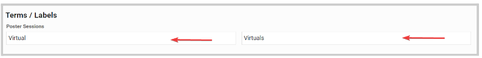
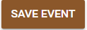

import React from 'react';
import { shareArticle } from '../../share.js';
import { FaLink } from 'react-icons/fa';
import { ToastContainer, toast } from 'react-toastify';
import 'react-toastify/dist/ReactToastify.css';

export const ClickableTitle = ({ children }) => (
    <h1 style={{ display: 'flex', alignItems: 'center', cursor: 'pointer' }} onClick={() => shareArticle()}>
        {children} 
        <FaLink size="0.6em" />
    </h1>
);

<ToastContainer />

<ClickableTitle>Rename Poster Sessions</ClickableTitle>

You can rename/label the poster sessions to any name that best fits your event. 

1. Go to **Events**, and click the desired event tile

2. From the left panel, click **Conference** 

3. Under the **Terms / Labels** section, you can assign the preferred name to both singular and plural 

4. Click Save Event at the bottom 

