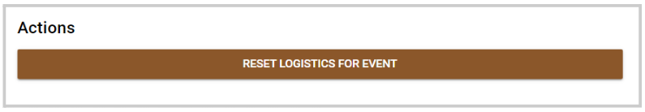
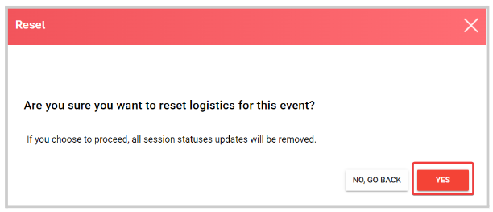

import { shareArticle } from '../../../components/share.js';
import { FaLink } from 'react-icons/fa';
import { ToastContainer, toast } from 'react-toastify';
import 'react-toastify/dist/ReactToastify.css';

export const ClickableTitle = ({ children }) => (
    <h1 style={{ display: 'flex', alignItems: 'center', cursor: 'pointer' }} onClick={() => shareArticle()}>
        {children} 
        <FaLink size="0.6em" />
    </h1>
);

<ToastContainer />

<ClickableTitle>Reset Logistics for Event</ClickableTitle>

1. Go to the desired event 

2. From the left panel, click **Logistics**

3. Click the gear icon  on the right top corner

4. Click the **Logistic Configurations** tab 

5. Scroll to the bottom of the window to the **Actions**section and click **Reset Logistics for Event**

6. From the pop-up windows, click **Yes**

****

