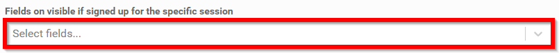

import React from 'react';
import { shareArticle } from '../../share.js';
import { FaLink } from 'react-icons/fa';
import { ToastContainer, toast } from 'react-toastify';
import 'react-toastify/dist/ReactToastify.css';

export const ClickableTitle = ({ children }) => (
    <h1 style={{ display: 'flex', alignItems: 'center', cursor: 'pointer' }} onClick={() => shareArticle()}>
        {children} 
        <FaLink size="0.6em" />
    </h1>
);

<ToastContainer />

<ClickableTitle>Session Display for Attendees & Speakers</ClickableTitle>

1. From the desired event navigate to select **Conference**

2. In the **Session Display for Attendees & Speakers** the administrator will be able to set the session display to allow additional information other than Title and Description to display to the targeted audience

3. Click inside the drop down menu to expand **session detail** options available on a per event basis

4. Set the tone for what fields are only visible if the targeted audience has **registered** for the event

5. Set the tone for what fields are only visible signed up for the **specific session**

6. After customizing what sessions are displayed select **SAVE EVENT**

 

