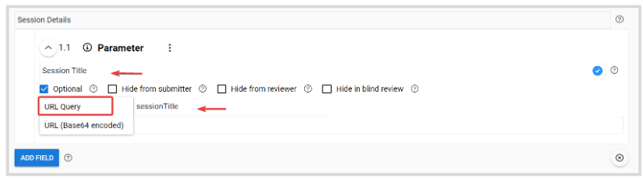

import React from 'react';
import { shareArticle } from '../../share.js';
import { FaLink } from 'react-icons/fa';
import { ToastContainer, toast } from 'react-toastify';
import 'react-toastify/dist/ReactToastify.css';

export const ClickableTitle = ({ children }) => (
    <h1 style={{ display: 'flex', alignItems: 'center', cursor: 'pointer' }} onClick={() => shareArticle()}>
        {children} 
        <FaLink size="0.6em" />
    </h1>
);

<ToastContainer />

<ClickableTitle>Session Survey Setup using URL Parameters</ClickableTitle>

This form field will allow you to obtain additional input parameters or information through a designated URL. When creating a Survey form, you can easily track specific session details to identify the session that belongs to for reporting purposes. Find the steps to follow below:

1. Go to **Calls** and click **Create New Call**. You can find the detailed steps to follow on how to create a Call [**here**](https://docs-for-customers.slayte.com/hc/en-us/articles/115010033388-Create-a-Call)  
2. When creating the submission phase form, it is recommendable yet not mandatory to add a section for parameter fields for easy location. Click **Add field** 

3. Select **Parameter**

****

4. Type the field **name**, select in the **source** field the option **URL Query**, and enter a **Path**

**Note:**  At the moment, the only available details to obtain are the session title and ID. Also, keep in mind, Path needs to be entered in camel case. 

5. Once ready with all form fields, click **Save**

6. Once the form has been created, you can follow these steps on how to **enable Survey** to your event sessions [**here**](https://docs-for-customers.slayte.com/hc/en-us/articles/14835126163219) to use the previously created form as below 

7. When submitting the survey, these details will be automatically populated

