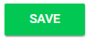

import { shareArticle } from '../../../components/share.js';
import { FaLink } from 'react-icons/fa';
import { ToastContainer, toast } from 'react-toastify';
import 'react-toastify/dist/ReactToastify.css';

export const ClickableTitle = ({ children }) => (
    <h1 style={{ display: 'flex', alignItems: 'center', cursor: 'pointer' }} onClick={() => shareArticle()}>
        {children} 
        <FaLink size="0.6em" />
    </h1>
);

<ToastContainer />

<ClickableTitle>Set Date(s)</ClickableTitle>

1. From the Home page select **Events** from the tile or from the left pane

2. Select the desired event

3. Select **General** 

4. Below the event description set the Start and End Date by clicking/tapping in the **Start Date** to select the desired start date 

5. Follow step 4 for selecting desired **End Date**

6. Select **SAVE** to complete changes

