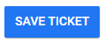

import React from 'react';
import { shareArticle } from '../../share.js';
import { FaLink } from 'react-icons/fa';
import { ToastContainer, toast } from 'react-toastify';
import 'react-toastify/dist/ReactToastify.css';

export const ClickableTitle = ({ children }) => (
    <h1 style={{ display: 'flex', alignItems: 'center', cursor: 'pointer' }} onClick={() => shareArticle()}>
        {children} 
        <FaLink size="0.6em" />
    </h1>
);

<ToastContainer />

<ClickableTitle>Set Registration Tickets</ClickableTitle>

1. Go to the desired event 

2. From the left panel, click **Registration**

****

2. In the **Tickets & Session Access** section, click **Create Ticket**

****

3. Fill in the following **New Ticket** information:

* **Name**
* **Price**
	+ Free
	+ Payment
	+ Restriction
* **Description**
* **Override default access for all sessions**
	+ (Default settings apply)
	+ Disable Access
	+ Free
	+ Payment
	+ Validation: you can select specific criteria the attendee must meet; for example

* **Override access for specific sessions**. You can set access restrictions for specific sessions by following these steps:

- Click **Edit**

- Then click **Add Access Rule For Session**

- Search by name the specific session to set up

- Under **Configure access rule for this session**, select the action: Disable Access, Free, Payment, Validation.

- Click **Save Session Access Rule**, then **Save Access Rule**to complete the process

* **Eligibility**
	+ Add Restrictions, if necessary

4. Click **SAVE TICKET** when ready

5. From the Registrations main page, scroll down and click **Save Event** to complete the process.

