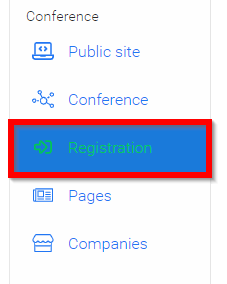
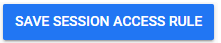

import React from 'react';
import { shareArticle } from '../../share.js';
import { FaLink } from 'react-icons/fa';
import { ToastContainer, toast } from 'react-toastify';
import 'react-toastify/dist/ReactToastify.css';

export const ClickableTitle = ({ children }) => (
    <h1 style={{ display: 'flex', alignItems: 'center', cursor: 'pointer' }} onClick={() => shareArticle()}>
        {children} 
        <FaLink size="0.6em" />
    </h1>
);

<ToastContainer />

<ClickableTitle>Set Session Access</ClickableTitle>

1. Select the desired event, then click **Registration**

2. In the **Session Access** section set the tone for the default access for all sessions by clicking in the dropdown menu **Free** where you will be able to change the default to **Disable Access,** **Payment or Validation**

3. If you would like to set a certain access level to only specific sessions, click **Edit**in the **Access to specific sessions**section.

4. On the next page, select **Add Access Rule For Session** button

5. Use the dropdown menu to **select sessions** that will have the new rule

6. Configure the access rule for the session **How can this session be accessed?**

* Disable Access
* Free
* Payment
* Validation

7. When ready to save, select **Save Sessions Access Rule**

8. Then **Save Access Rules** to complete the process. 

