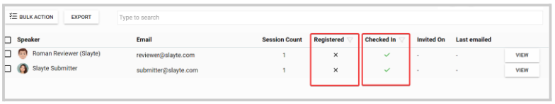

import { shareArticle } from '../../../components/share.js';
import { FaLink } from 'react-icons/fa';
import { ToastContainer, toast } from 'react-toastify';
import 'react-toastify/dist/ReactToastify.css';

export const ClickableTitle = ({ children }) => (
    <h1 style={{ display: 'flex', alignItems: 'center', cursor: 'pointer' }} onClick={() => shareArticle()}>
        {children} 
        <FaLink size="0.6em" />
    </h1>
);

<ToastContainer />

<ClickableTitle>Speaker's Check-in / Registration Status</ClickableTitle>

You can access real-time checked-in and registration status information for the speakers in the event. 

1. From the desired event, click **Speakers**

2. The Checked-in and Registration status is separated by columns in the speaker's list 

From here, you can filter for only Registered/ Checked in or not Registered/ Checked in by clicking the filter button  next to each column. Additionally, you can overview the following information: 

* Session Count
* Invited On
* Last emailed
* Export: a report that will include all speaker's data. For more information on how to generate this report, go [here](https://docs-for-customers.slayte.com/hc/en-us/articles/12910558222867)

