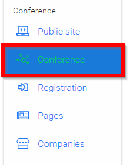
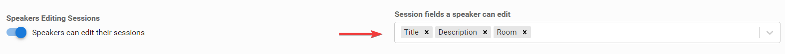

import { shareArticle } from '../../../components/share.js';
import { FaLink } from 'react-icons/fa';
import { ToastContainer, toast } from 'react-toastify';
import 'react-toastify/dist/ReactToastify.css';

export const ClickableTitle = ({ children }) => (
    <h1 style={{ display: 'flex', alignItems: 'center', cursor: 'pointer' }} onClick={() => shareArticle()}>
        {children} 
        <FaLink size="0.6em" />
    </h1>
);

<ToastContainer />

<ClickableTitle>Specify What Speakers Can Modify in Their Sessions</ClickableTitle>

1. Navigate to Conference

2. **Slide toggle** from Only admins can edit sessions to Speakers can edit their sessions

3. Click inside **Session fields a speaker can edit** to select what Speakers can edit on their sessions, and use the drop-down to select the desired fields. 

4. Select **SAVE EVENT** when finished

 

