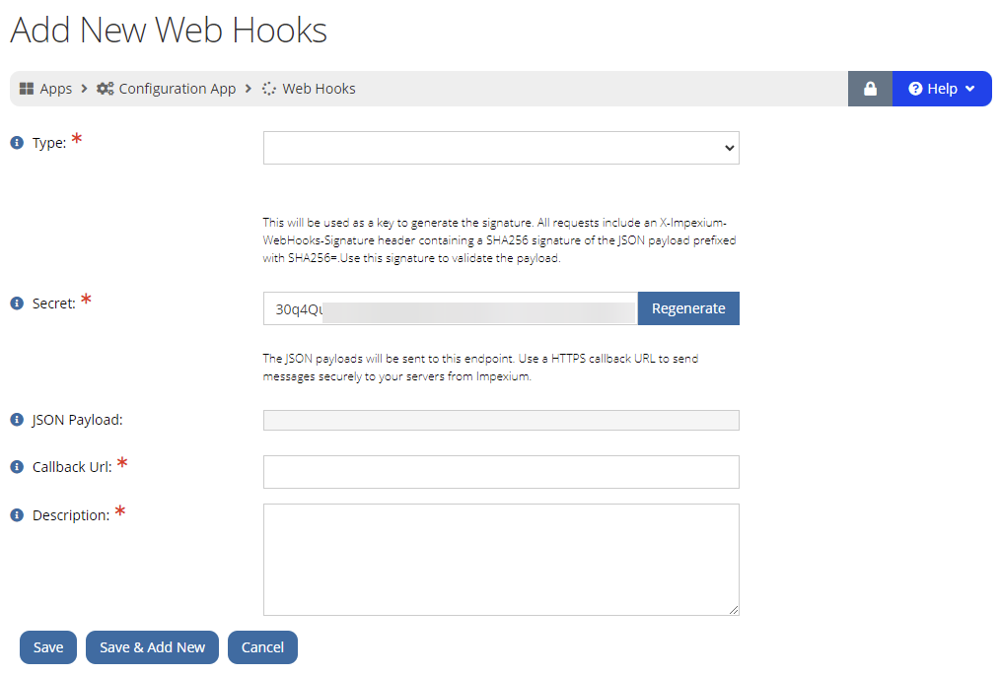

import { shareArticle } from '../../../components/share.js';
import { FaLink } from 'react-icons/fa';
import { ToastContainer, toast } from 'react-toastify';
import 'react-toastify/dist/ReactToastify.css';

export const ClickableTitle = ({ children }) => (
    <h1 style={{ display: 'flex', alignItems: 'center', cursor: 'pointer' }} onClick={() => shareArticle()}>
        {children} 
        <FaLink size="0.6em" />
    </h1>
);

<ToastContainer />

<ClickableTitle>Webhook Integration with Slayte-Impexium for Events</ClickableTitle>

### Introduction

Impexium can set up a webhook with Slayte to effectively communicate specific actions and behaviors. This is entirely configured within Impexium, and the result is an automated processes within Slayte upon certain actions or triggers in Impexium.

 

### Preparation

Each webhook action requires an API secret, which can be provided by Slayte Technical Support. However, if this is not your first event, you can reference any previous event, and use the same API secret to configure a new event.

 

### Creating Webhooks in Impexium

As an administrator, webhook configurations can be accessed from **Impexium > Apps > Configuration > WebHooks**. Next, click on **Add New WebHook +.**

****

 

Further specs on how-to configure webhooks, can be found in this Impexium [Help Center article.](https://help.impexium.com/imp/Content/webhook_creating.htm?Highlight=Webhook)

 

### Webhook Event Actions

*Note: XYZ should be substituted by your platform site.*

### Event Registration Created

This action will automatically create registrations in Slayte, whenever a user has registered for an event in Impexium and lands on the Slayte Event page, essentially eliminating the need to register on Slayte after registering in Impexium.

 

**Configuration**

**Type:** Event Registration Created

**Event:** (This should connect to the corresponding Impexium Event that will have the setup).

**Secret:** Must match the Slayte API secret in our database

**Callback URL:** `https://xyz.slayte.com/api/hook/impexium/individual-event-registration`

**Description:** For descriptive purposes.

 

### Product Purchased

This action will automatically send a payload to purchased products related to the event to Slayte, eg: paid session ticket.

 

**Configuration**

**Type:** Product Purchased

**Event:** (This should connect to the corresponding Impexium Event that will have the setup).

**Secret:** Must match the Slayte API secret in our database

**Callback URL:** `https://xyz.slayte.com/api/hook/impexium/individual-product-purchased`

**Description:** For descriptive purposes.

 

### Purchase Cancelled

This action will send automatically a payload to Slayte for a canceled product, eg: event registration, or session ticket.

 

**Configuration**

**Type:** Purchase Cancelled

**Event:** (This should connect to the corresponding Impexium Event that will have the setup).

**Secret:** Automatically Generated

**Callback URL:** `https://xyz.slayte.com/api/hook/impexium/individual-purchase-cancelled`

**Description:** For descriptive purposes.

 

### Webhook Action - Registration Substitution

This action will replace, the existing registrant with another registrant, remove access of registrant A, and provide access to registrant B.

 

**Configuration**

**Type:** Registration Substitution

**Event:** (This should connect to the corresponding Impexium Event that will have the setup).

**Secret:** Automatically Generated

**Callback URL:** `https://xyz.slayte.com/api/hook/impexium/individual-registration-substituted`

**Description:** For descriptive purposes.

/_

