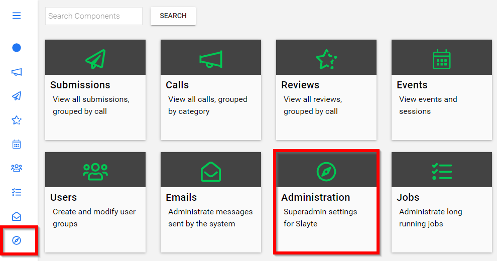
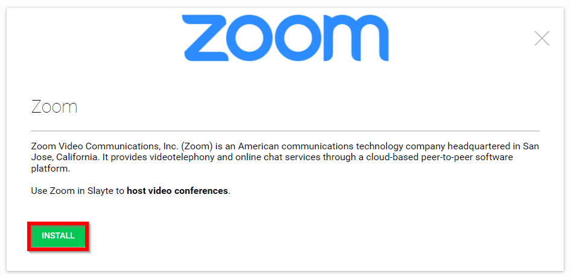
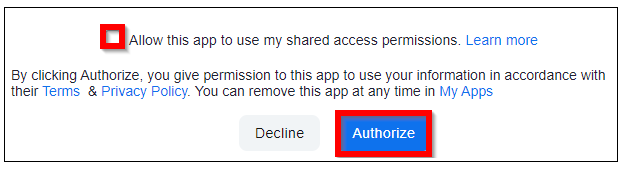
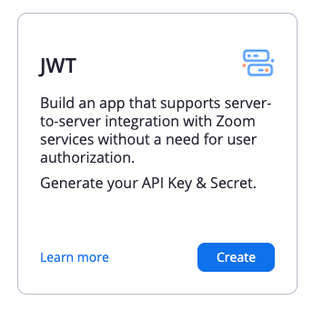
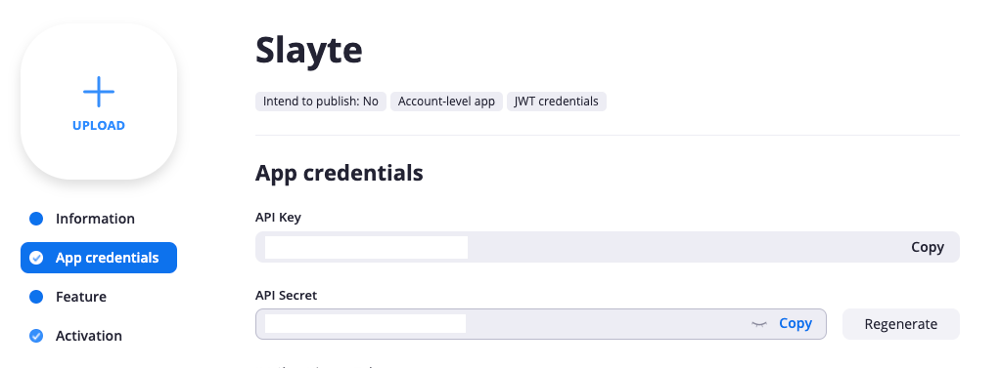

import React from 'react';
import { shareArticle } from '../../share.js';
import { FaLink } from 'react-icons/fa';
import { ToastContainer, toast } from 'react-toastify';
import 'react-toastify/dist/ReactToastify.css';

export const ClickableTitle = ({ children }) => (
    <h1 style={{ display: 'flex', alignItems: 'center', cursor: 'pointer' }} onClick={() => shareArticle()}>
        {children} 
        <FaLink size="0.6em" />
    </h1>
);

<ToastContainer />

<ClickableTitle>Zoom Integration</ClickableTitle>

Slayte has a generic Zoom integration that lets you add Zoom meetings to sessions. This is always available on each session and you can simply paste the join link and add the meeting ID and passcode.

However, Slayte is also a [Zoom partner](https://marketplace.zoom.us/apps/iwf4y3oHRIm04kGmx1kWeg) and has the deepest integration with Zoom available on the market. As part of this integration, the software can join designated users as Zoom hosts, without the need for them to be on your Zoom license. This means that you can let your speakers run their own meetings, without the need for a Staff member to join every Zoom session. The speakers can start it themselves.

Additionally, Slayte allows you to add **multiple Zoom licenses** so that your team can run multiple overlapping sessions (Zoom limits to one meeting per registered Zoom account owner, but Slayte lets you add multiple so you are no longer limited).

 

To link a new Zoom account, you have to be a **Superadmin** on the account. Then follow the steps below:

1. From the home screen select the **Administration** tile or the Administration icon from the left pane

2. Navigate to the Features category then select **Marketplace**

3. Select **Zoom**

4. Select **INSTALL**

****

5. Type in **Installation Label** (create a name that is easy for you to identify) then select **INSTALL NOW**

6. You will be redirected to your Zoom account to complete the Slayte to Zoom connection 

7. Select the **Allow this app to use my shared access permissions** and **Authorize**

8. After saving the configuration, we now proceed to add the Slayte App to your Zoom account.  
Visit this URL: <https://marketplace.zoom.us/develop/create>

9. Click on **Create** in the JWT app:

10. Enter **Slayte** as the name, and follow the steps

11. Go to **App credentials** and copy the **API Key** and **API Secret**. We will paste them into Slayte shortly.

 

12. Back in Slayte, select **Configure** on the newly labeled installation (under "Administration" > "Marketplace" > "Zoom" and select the installation label you entered in step 5. above)

13. In the configuration modal now paste the **JWT App API Key** and **JWT App API Secret** (which we copied in step 11. above), then select **SAVE**

Now your Zoom is fully configured with Slayte, and you can use all the benefits of having a fully integrated Zoom solution and can have speakers join as hosts without being connected to your account.

**Note:** Slayte allows you to add multiple licenses, so you can repeat the steps above for another Zoom license, as well.

 

 

