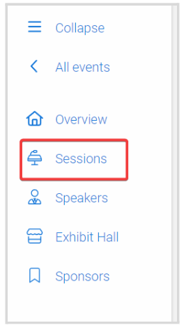
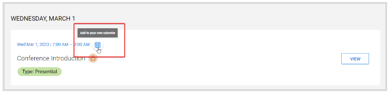
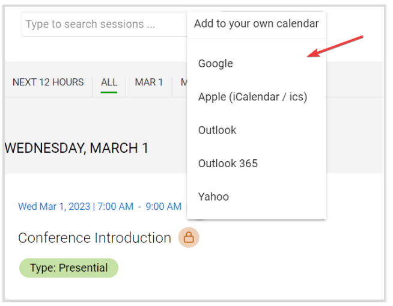
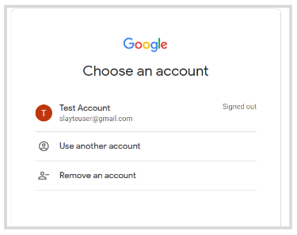
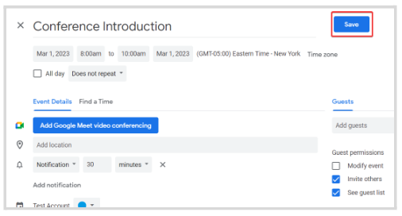

import { shareArticle } from '../../../components/share.js';
import { FaLink } from 'react-icons/fa';
import { ToastContainer, toast } from 'react-toastify';
import 'react-toastify/dist/ReactToastify.css';

export const ClickableTitle = ({ children }) => (
    <h1 style={{ display: 'flex', alignItems: 'center', cursor: 'pointer' }} onClick={() => shareArticle()}>
        {children} 
        <FaLink size="0.6em" />
    </h1>
);

<ToastContainer />

<ClickableTitle>Add a Session To Your Own Calendar</ClickableTitle>

Any session can be added to your personal calendar if you are looking for a more familiar view, additionally, you can keep track of the session by managing reminders, adding notes etc. directly from your own calendar. Follow the steps below: 

1. From the **Event**, click the **Sessions** **Tab** from the left panel

   
2. Locate the desired session, and click the **Calendar icon** next to the session's title

3. Select your **email provider** from the list

4. You'll be routed to **sign in** to the email account you selected. The example below is with a Google account:

Then, confirm the session details, set notifications, description, etc; as desired, and Save

