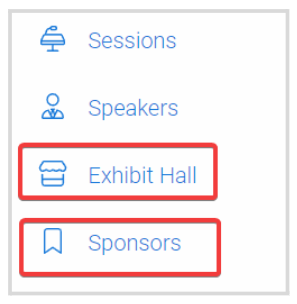
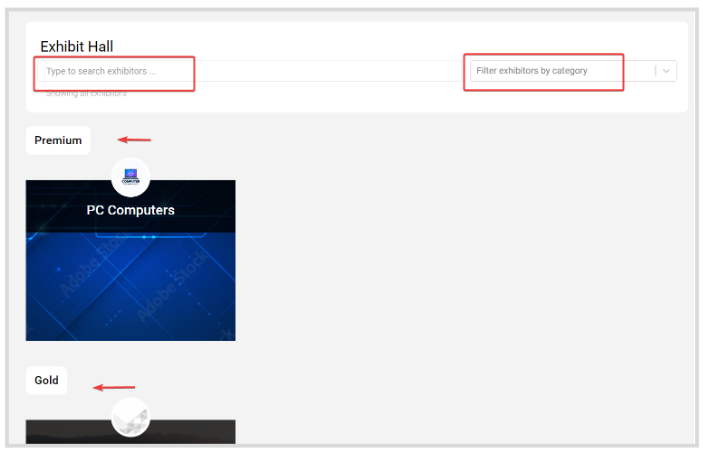
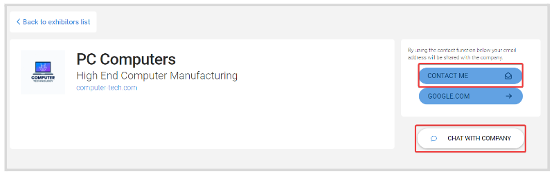

import { shareArticle } from '../../../components/share.js';
import { FaLink } from 'react-icons/fa';
import { ToastContainer, toast } from 'react-toastify';
import 'react-toastify/dist/ReactToastify.css';

export const ClickableTitle = ({ children }) => (
    <h1 style={{ display: 'flex', alignItems: 'center', cursor: 'pointer' }} onClick={() => shareArticle()}>
        {children} 
        <FaLink size="0.6em" />
    </h1>
);

<ToastContainer />

<ClickableTitle>Connect With Event Exhibitors & Sponsors</ClickableTitle>

You can easily browse and contact any of the Exhibitors and Sponsors that have agreed to be part of the event. Follow the steps below:

1. From the Home Page, go to **Events** and click the desired event tile  
2. Click **Exhibit Hall** or **Sponsors** from the left panel

3. Here Exhibitors/ Sponsors are by default sorted by their assigned **level**, however, you can search them by **name** or filter them by **category**

  
4. Click the **Exhibitor/Sponsor tile** for additional details. You can click **Contact Me** to share your email address with the company for them to reach you, or click **Chat with Company** for immediate communication if someone is available

****

**Note:** Both these options are enabled by the Administrator and may not be available. You may contact the event administrator for more information

