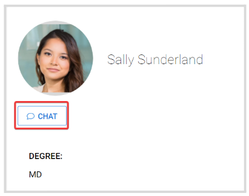

import { shareArticle } from '../../../components/share.js';
import { FaLink } from 'react-icons/fa';
import { ToastContainer, toast } from 'react-toastify';
import 'react-toastify/dist/ReactToastify.css';

export const ClickableTitle = ({ children }) => (
    <h1 style={{ display: 'flex', alignItems: 'center', cursor: 'pointer' }} onClick={() => shareArticle()}>
        {children} 
        <FaLink size="0.6em" />
    </h1>
);

<ToastContainer />

<ClickableTitle>Connect With Speakers</ClickableTitle>

Find and communicate with all speakers at the event. You can send connection requests, chat, and view their sessions.

From within the event, go to the **Speakers** tab from the left panel. On the main Speaker page, you can browse the list or search by name. Then click the speaker tile for additional information

From the Speaker's profile, you can **Connect With** the speaker by sending a request

With your connection request, you can include a personalized message

Once the request has been accepted, this speaker will be added to your **Contacts,** and you'll have the **Chat** option 

In the **Speaker Sessions** section, you'll find all the event sessions in which this person is assigned as Speaker. Click **View** for session details

